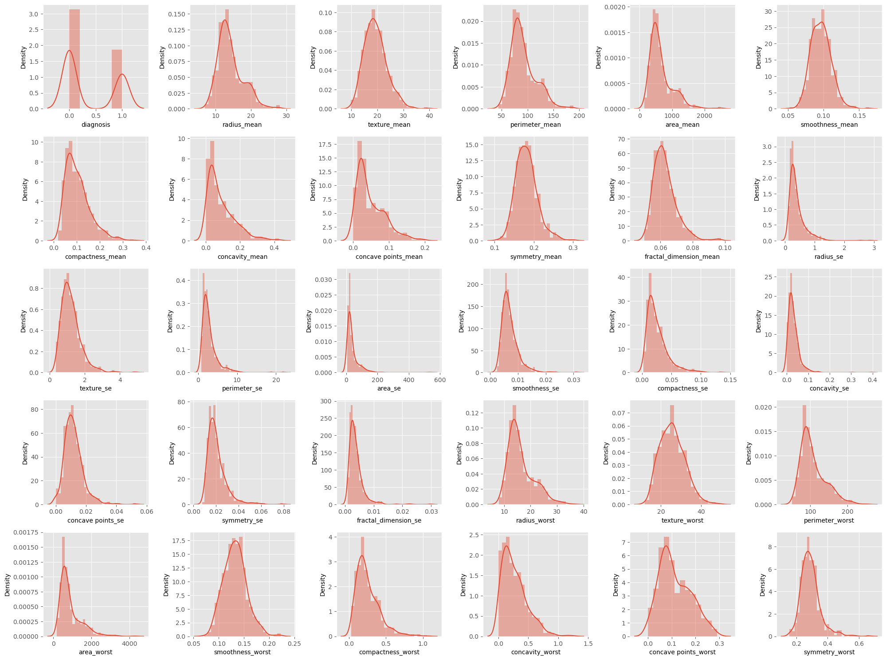
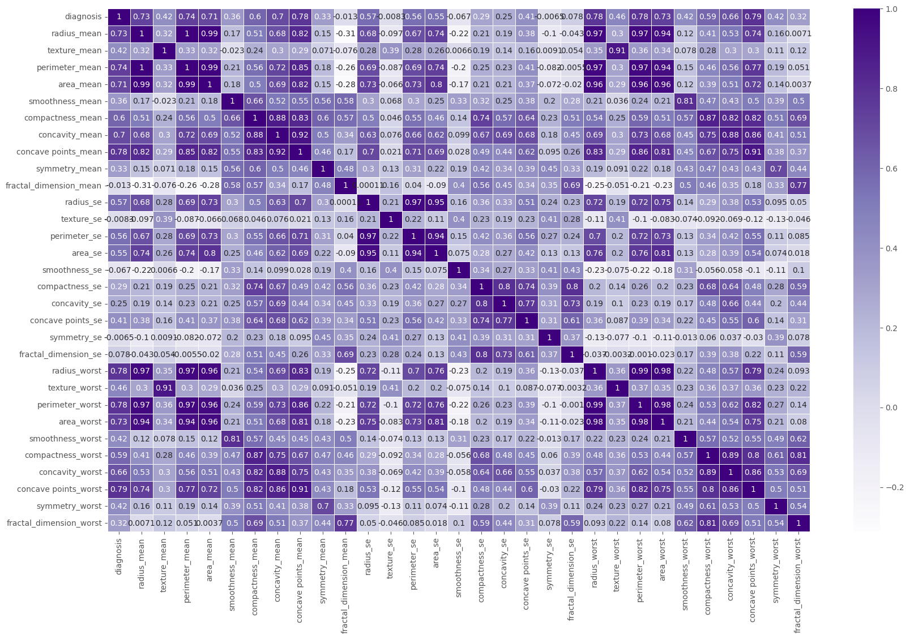
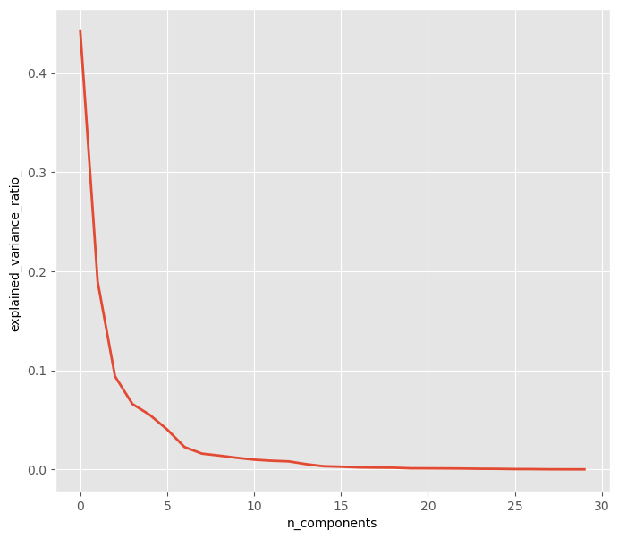

<div style="color:#fde8f5;
           display:fill;
           border-radius:5px;
           background-color:#e7189b;
           font-size:120%;
           font-family:Bahnschrift SemiBold;
           letter-spacing:0.5px;
           padding-top: 25px;
           padding-bottom: 25px;">

<h1 align = "center">
BREAST CANCER WISCONSIN DATA ANALYSIS<a name = "title"></a>
    </h1>
</div>

<div style="color:#e7189b;
           display:fill;
           background-color:#f8bae1;
           font-size:100%;
           font-family:Bahnschrift SemiBold;
           letter-spacing:0.5px;
           padding-top: 3px;
           padding-bottom: 3px;">

<h1 align = "center">
BY SRUSHTI SHIMPI<a name = "v"></a></h1>
</div>


<div style="color:#fde8f5;
           display:fill;
           border-radius:5px;
           background-color:#8a0f5d;
           font-size:120%;
           font-family:Bahnschrift SemiBold;
           letter-spacing:0.5px;
           padding-top: 25px;
           padding-bottom: 25px;">

<h1 align = "center">
TABLE OF CONTENTS<a name = "t"></a>
    </h1>
</div>

<div style="color:#000000;
           font-size:120%;
           font-family:Bahnschrift SemiBold;
           letter-spacing:0.5px;">

[INTRODUCTION](#intro)

[MYTHS AND FACTS](#1.2)

[AIM OF THE PROJECT](#1.3)

[ABOUT THE DATASET](#1.4)

1. [IMPORTING LIBRARIES](#1)
    <BR>
        <BR>
2. [READING THE DATASET](#2)
                <BR>
        <BR>
3. [DATA PREPROCESSING](#3)
                <BR>
        <BR>
4. [EXPLORATORY DATA ANALYSIS (EDA)](#4)
                <BR>
        <BR>
5. [PRINCIPLE COMPONENT ANALYSIS (PCA)](#5)
                <BR>
        <BR>
6. [TRAIN-TEST SPLITING OF DATA](#6)
                <BR>
        <BR>
7. [MACHINE LEARNING MODELS](#7)
                <BR>
        <BR>
    7.1. [LOGISTIC REGRESSION](#7.1)
                <BR>
        <BR>
    7.2. [K-NEAREST NEIGHBOUR (KNN)](#7.2)
                <BR>
        <BR>
    7.3. [SUPPORT VECTOR CLASSIFIER (SVC)](#7.3)
                <BR>
        <BR>
    7.4. [SDG CLASSIFIER](#7.4)
                <BR>
        <BR>
    7.5. [DECISION TREE CLASSIFIER](#7.5)
                <BR>
        <BR>
    7.6. [RANDOM FOREST CLASSIFIER](#7.6)
                <BR>
        <BR>
    7.7. [VOTING CLASSIFIER](#7.7)
                <BR>
        <BR>
    7.8. [ADA BOOST CLASSIFIER](#7.8)
                <BR>
        <BR>
    7.9. [GRADIENT BOOSTING CLASSIFIER](#7.9)
                <BR>
        <BR>
    7.10. [STOCHASTIC GRADIENT BOOSTING (SGB) CLASSIFIER](#7.10)
                <BR>
        <BR>
    7.11. [EXTREAM GRADIENT BOOSTING (XGB) CLASSIFIER](#7.11)
                <BR>
        <BR>
8. [FINDING THE BEST MODEL](#8)
    

</div>


<div style="color:#b9137c;
           display:fill;
           background-color:#f8bae1;
           font-size:100%;
           font-family:Bahnschrift SemiBold;
           letter-spacing:0.5px;
           padding-top: 3px;
           padding-bottom: 3px;">

<h1 align = "center">
INTRODUCTION<a name = "intro"></a></h1>
</div>


<div style="color:#000000;
           font-size:120%;
           font-family:Bahnschrift SemiBold;
           letter-spacing:0.5px;">
    Breast Cancer is the most common cancer and it is highly reporting type of a skin cancer today. According to <a href = "https://www.who.int/news-room/fact-sheets/detail/breast-cancer#:~:text=In%202020%2C%20there%20were%202.3,the%20world's%20most%20prevalent%20cancer">World Health Organization (WHO)</a> , in 2020, there were 2.3 million women diagnosed with Breast Cancer and 685,000 deaths globally. As of the end of 2020, there were 7.8 million women alive who were diagnosed with breast cancer in the past 5 years. As above infographics, it gives us idea about Breast Cancer and how it is impacting the world. Due to our modern and lathergic lifestyle, Breast Cancer has became a big issue in the world of healthcare. Breast Cancer can occur in both men and women, but as per medical research, women are twice susceptible to Breast Cancer. And therefore, it is important to diagnose cancer in early stages.

<div style="color:#b9137c;
           display:fill;
           background-color:#f8bae1;
           font-size:100%;
           font-family:Bahnschrift SemiBold;
           letter-spacing:0.5px;
           padding-top: 3px;
           padding-bottom: 3px;">

<h1 align = "center">
MYTHS AND FACTS <a name = "1.2"></a>
    </h1>
</div>

<div style="color:#000000;
           font-size:120%;
           font-family:Bahnschrift SemiBold;
           letter-spacing:0.5px;">

<p>Breast Cancer is one of the better-known and more-talked-about cancers, but there are still many misconceptions. Although there is more Breast Cancer awareness now than before, there are still several Breast Cancer myths and facts that people wrongly interchange, resulting in them not knowing the best care for Breast Cancer. It is important to differentiate between myths and facts so that we know how to prevent Breast Cancer and what to do if we are diagnosed with it. Breast Cancer myths and facts are listed as follow:</p></div>


<div style="color:#000000;
           font-size:120%;
           font-family:Bahnschrift SemiBold;
           letter-spacing:0.5px;">

<p>
Breast cancer is cancer that forms in the cells of the breasts.

It arises in the lining cells (epithelium) of the ducts (85%) or lobules (15%) in the glandular tissue of the breast. Initially, the cancerous growth is confined to the duct or lobule (“in situ”) where it generally causes no symptoms and has minimal potential for spread (metastasis).

Most types of breast cancer are easy to diagnose by microscopic analysis of a sample - or biopsy - of the affected area of the breast. Also, there are types of breast cancer that require specialized lab exams.

Modern AI developments constantly reduce the gap between ML algorithms and humans. Back in the 90's, the "Wisconsin Breast Cancer Dataset" (WBCD) )) was released, and soon gained a recognition as one of the first milestones of AI. In the absence of any advanced computational equipment, scientists were focused on extraction of meaningful insights, in attempt to distinguish between the samples : </p></div>


<div style="color:#000000;
           font-size:120%;
           font-family:Bahnschrift SemiBold;
           letter-spacing:0.5px;">

<p>Interestingly, several suspicious differences were found, thereby encouraging researchers to further understand what dominant features may affect the decision rule:</p></div>


<div style="color:#b9137c;
           display:fill;
           background-color:#f8bae1;
           font-size:100%;
           font-family:Bahnschrift SemiBold;
           letter-spacing:0.5px;
           padding-top: 3px;
           padding-bottom: 3px;">

<h1 align = "center">
AIM OF THE PROJECT <a name = "1.3"></a></h1>
</div>

<div style="color:#000000;
           font-size:120%;
           font-family:Bahnschrift SemiBold;
           letter-spacing:0.5px;">

<p>The goal of the project is to diagnose whether the tumor is benign or malignant in the given data. While making this dignosis, we will make use of the features in our data which will help us in diagnosis of benign tumor and malignant tumor.</p>

<p>First, we will examine the data in detail. We will detect missing data and outliers. Later, we will make visualizations and see which machine learning classification models are giving us high accuracy. It will help us diagnose benign tumor and malignant tumor correctly.</p>

<p>I have tried my best to explain the code very clearly. In this notebook, I will be using  classification models- Logistic Regression, K Nearest Neighbours, Random Forests and Support Vector Machines (SVM), SVC, Extratree, Gradient Boosting,XG Boost, LightGBM, Adaboost.</p></div>

<div style="color:#b9137c;
           display:fill;
           background-color:#f8bae1;
           font-size:100%;
           font-family:Bahnschrift SemiBold;
           letter-spacing:0.5px;
           padding-top: 3px;
           padding-bottom: 3px;">

<h1 align = "center">
ABOUT THE DATASET <a name = "1.4"></a></h1>
</div>

<div style="color:#000000;
           font-size:120%;
           font-family:Bahnschrift SemiBold;
           letter-spacing:0.5px;">
 <h2>About this kernel</h2>

* The Breast Cancer datasets is available at [UCI machine learning repository](https://archive.ics.uci.edu/ml/datasets/Breast+Cancer+Wisconsin+%28Diagnostic%29) maintained by the University of California, Irvine.

* The dataset contains 569 samples of malignant and benign tumor cells.

* The first two columns in the dataset store the unique ID numbers of the samples and the corresponding diagnosis (M=malignant, B=benign), respectively.

* The columns 3-32 contain 30 real-value features that have been computed from digitized images of the cell nuclei, which can be used to build a model to predict whether a tumor is benign or malignant.

    * M= Malignant (Cancerous) - Present (1)
    
    * B= Benign (Not Cancerous) -Absent (0)
    
 
<h2>Attribute Information:</h2>
    
 * **ID number**
 
 * **Diagnosis (M = malignant, B = benign)**

<h2>Ten real-valued features are computed for each cell nucleus:</h2>
 
* **radius (mean of distances from center to points on the perimeter)**

* **texture (standard deviation of gray-scale values)**

* **perimeter**

* **area**

* **smoothness (local variation in radius lengths)**

* **compactness (perimeter^2 / area - 1.0)**

* **concavity (severity of concave portions of the contour)**

* **concave points (number of concave portions of the contour)**

* **symmetry**

* **fractal dimension ("coastline approximation" - 1)** 

Features describe characteristics of the cell nuclei present in the image above. The mean, standard error and "worst" or largest (mean of the three largest values) of these features were computed for each image, resulting in 30 features.


<div style="color:#b9137c;
           display:fill;
           background-color:#f8bae1;
           font-size:100%;
           font-family:Bahnschrift SemiBold;
           letter-spacing:0.5px;
           padding-top: 3px;
           padding-bottom: 3px;">

<h1 align = "center">
1. IMPORTING LIBRARIES<a name = "1"></a></h1>
</div>


```python
import pandas as pd
import numpy as np
import seaborn as sns
import matplotlib.pyplot as plt

#!pip install missingno
import missingno as msno

import warnings
warnings.filterwarnings('ignore')


plt.style.use('ggplot')

```

<div style="color:#b9137c;
           display:fill;
           background-color:#f8bae1;
           font-size:100%;
           font-family:Bahnschrift SemiBold;
           letter-spacing:0.5px;
           padding-top: 3px;
           padding-bottom: 3px;">

<h1 align = "center">
2. READING THE DATASET<a name = "2"></a></h1>
</div>


```python
df = pd.read_csv('data.csv')
```


```python
df.head()
```


<div>
<style scoped>
    .dataframe tbody tr th:only-of-type {
        vertical-align: middle;
    }

    .dataframe tbody tr th {
        vertical-align: top;
    }

    .dataframe thead th {
        text-align: right;
    }
</style>
<table border="1" class="dataframe">
  <thead>
    <tr style="text-align: right;">
      <th></th>
      <th>id</th>
      <th>diagnosis</th>
      <th>radius_mean</th>
      <th>texture_mean</th>
      <th>perimeter_mean</th>
      <th>area_mean</th>
      <th>smoothness_mean</th>
      <th>compactness_mean</th>
      <th>concavity_mean</th>
      <th>concave points_mean</th>
      <th>...</th>
      <th>texture_worst</th>
      <th>perimeter_worst</th>
      <th>area_worst</th>
      <th>smoothness_worst</th>
      <th>compactness_worst</th>
      <th>concavity_worst</th>
      <th>concave points_worst</th>
      <th>symmetry_worst</th>
      <th>fractal_dimension_worst</th>
      <th>Unnamed: 32</th>
    </tr>
  </thead>
  <tbody>
    <tr>
      <th>0</th>
      <td>842302</td>
      <td>M</td>
      <td>17.99</td>
      <td>10.38</td>
      <td>122.80</td>
      <td>1001.0</td>
      <td>0.11840</td>
      <td>0.27760</td>
      <td>0.3001</td>
      <td>0.14710</td>
      <td>...</td>
      <td>17.33</td>
      <td>184.60</td>
      <td>2019.0</td>
      <td>0.1622</td>
      <td>0.6656</td>
      <td>0.7119</td>
      <td>0.2654</td>
      <td>0.4601</td>
      <td>0.11890</td>
      <td>NaN</td>
    </tr>
    <tr>
      <th>1</th>
      <td>842517</td>
      <td>M</td>
      <td>20.57</td>
      <td>17.77</td>
      <td>132.90</td>
      <td>1326.0</td>
      <td>0.08474</td>
      <td>0.07864</td>
      <td>0.0869</td>
      <td>0.07017</td>
      <td>...</td>
      <td>23.41</td>
      <td>158.80</td>
      <td>1956.0</td>
      <td>0.1238</td>
      <td>0.1866</td>
      <td>0.2416</td>
      <td>0.1860</td>
      <td>0.2750</td>
      <td>0.08902</td>
      <td>NaN</td>
    </tr>
    <tr>
      <th>2</th>
      <td>84300903</td>
      <td>M</td>
      <td>19.69</td>
      <td>21.25</td>
      <td>130.00</td>
      <td>1203.0</td>
      <td>0.10960</td>
      <td>0.15990</td>
      <td>0.1974</td>
      <td>0.12790</td>
      <td>...</td>
      <td>25.53</td>
      <td>152.50</td>
      <td>1709.0</td>
      <td>0.1444</td>
      <td>0.4245</td>
      <td>0.4504</td>
      <td>0.2430</td>
      <td>0.3613</td>
      <td>0.08758</td>
      <td>NaN</td>
    </tr>
    <tr>
      <th>3</th>
      <td>84348301</td>
      <td>M</td>
      <td>11.42</td>
      <td>20.38</td>
      <td>77.58</td>
      <td>386.1</td>
      <td>0.14250</td>
      <td>0.28390</td>
      <td>0.2414</td>
      <td>0.10520</td>
      <td>...</td>
      <td>26.50</td>
      <td>98.87</td>
      <td>567.7</td>
      <td>0.2098</td>
      <td>0.8663</td>
      <td>0.6869</td>
      <td>0.2575</td>
      <td>0.6638</td>
      <td>0.17300</td>
      <td>NaN</td>
    </tr>
    <tr>
      <th>4</th>
      <td>84358402</td>
      <td>M</td>
      <td>20.29</td>
      <td>14.34</td>
      <td>135.10</td>
      <td>1297.0</td>
      <td>0.10030</td>
      <td>0.13280</td>
      <td>0.1980</td>
      <td>0.10430</td>
      <td>...</td>
      <td>16.67</td>
      <td>152.20</td>
      <td>1575.0</td>
      <td>0.1374</td>
      <td>0.2050</td>
      <td>0.4000</td>
      <td>0.1625</td>
      <td>0.2364</td>
      <td>0.07678</td>
      <td>NaN</td>
    </tr>
  </tbody>
</table>
<p>5 rows × 33 columns</p>
</div>


<div style="color:#b9137c;
           display:fill;
           background-color:#f8bae1;
           font-size:100%;
           font-family:Bahnschrift SemiBold;
           letter-spacing:0.5px;
           padding-top: 3px;
           padding-bottom: 3px;">

<h1 align = "center">
3. DATA PREPROCESSING<a name = "3"></a></h1>
</div>


```python
#SHAPE OF THE DATA
df.shape
```


    (569, 33)


```python
#CHECKING FOR COUNT OF NULL VALUES IN COLUMN
df.isnull().sum()
```


    id                           0
    diagnosis                    0
    radius_mean                  0
    texture_mean                 0
    perimeter_mean               0
    area_mean                    0
    smoothness_mean              0
    compactness_mean             0
    concavity_mean               0
    concave points_mean          0
    symmetry_mean                0
    fractal_dimension_mean       0
    radius_se                    0
    texture_se                   0
    perimeter_se                 0
    area_se                      0
    smoothness_se                0
    compactness_se               0
    concavity_se                 0
    concave points_se            0
    symmetry_se                  0
    fractal_dimension_se         0
    radius_worst                 0
    texture_worst                0
    perimeter_worst              0
    area_worst                   0
    smoothness_worst             0
    compactness_worst            0
    concavity_worst              0
    concave points_worst         0
    symmetry_worst               0
    fractal_dimension_worst      0
    Unnamed: 32                569
    dtype: int64


```python
#NUMBER OF COULMNS HAVING NULL VALUES
df.isnull().any().sum()
```


    1


```python
#DROPPING  ID AND UNIMED COLUMN
df.drop(['id','Unnamed: 32'], axis = 1, inplace = True)

```


```python
#assigning values to M & B (M=1)malignant, (B=0)begign 
df.diagnosis.unique()
```


    array(['M', 'B'], dtype=object)


```python
df['diagnosis'] = df['diagnosis'].apply(lambda val: 1 if val == 'M' else 0)
```


```python
df.head()
```


<div>
<style scoped>
    .dataframe tbody tr th:only-of-type {
        vertical-align: middle;
    }

    .dataframe tbody tr th {
        vertical-align: top;
    }

    .dataframe thead th {
        text-align: right;
    }
</style>
<table border="1" class="dataframe">
  <thead>
    <tr style="text-align: right;">
      <th></th>
      <th>diagnosis</th>
      <th>radius_mean</th>
      <th>texture_mean</th>
      <th>perimeter_mean</th>
      <th>area_mean</th>
      <th>smoothness_mean</th>
      <th>compactness_mean</th>
      <th>concavity_mean</th>
      <th>concave points_mean</th>
      <th>symmetry_mean</th>
      <th>...</th>
      <th>radius_worst</th>
      <th>texture_worst</th>
      <th>perimeter_worst</th>
      <th>area_worst</th>
      <th>smoothness_worst</th>
      <th>compactness_worst</th>
      <th>concavity_worst</th>
      <th>concave points_worst</th>
      <th>symmetry_worst</th>
      <th>fractal_dimension_worst</th>
    </tr>
  </thead>
  <tbody>
    <tr>
      <th>0</th>
      <td>1</td>
      <td>17.99</td>
      <td>10.38</td>
      <td>122.80</td>
      <td>1001.0</td>
      <td>0.11840</td>
      <td>0.27760</td>
      <td>0.3001</td>
      <td>0.14710</td>
      <td>0.2419</td>
      <td>...</td>
      <td>25.38</td>
      <td>17.33</td>
      <td>184.60</td>
      <td>2019.0</td>
      <td>0.1622</td>
      <td>0.6656</td>
      <td>0.7119</td>
      <td>0.2654</td>
      <td>0.4601</td>
      <td>0.11890</td>
    </tr>
    <tr>
      <th>1</th>
      <td>1</td>
      <td>20.57</td>
      <td>17.77</td>
      <td>132.90</td>
      <td>1326.0</td>
      <td>0.08474</td>
      <td>0.07864</td>
      <td>0.0869</td>
      <td>0.07017</td>
      <td>0.1812</td>
      <td>...</td>
      <td>24.99</td>
      <td>23.41</td>
      <td>158.80</td>
      <td>1956.0</td>
      <td>0.1238</td>
      <td>0.1866</td>
      <td>0.2416</td>
      <td>0.1860</td>
      <td>0.2750</td>
      <td>0.08902</td>
    </tr>
    <tr>
      <th>2</th>
      <td>1</td>
      <td>19.69</td>
      <td>21.25</td>
      <td>130.00</td>
      <td>1203.0</td>
      <td>0.10960</td>
      <td>0.15990</td>
      <td>0.1974</td>
      <td>0.12790</td>
      <td>0.2069</td>
      <td>...</td>
      <td>23.57</td>
      <td>25.53</td>
      <td>152.50</td>
      <td>1709.0</td>
      <td>0.1444</td>
      <td>0.4245</td>
      <td>0.4504</td>
      <td>0.2430</td>
      <td>0.3613</td>
      <td>0.08758</td>
    </tr>
    <tr>
      <th>3</th>
      <td>1</td>
      <td>11.42</td>
      <td>20.38</td>
      <td>77.58</td>
      <td>386.1</td>
      <td>0.14250</td>
      <td>0.28390</td>
      <td>0.2414</td>
      <td>0.10520</td>
      <td>0.2597</td>
      <td>...</td>
      <td>14.91</td>
      <td>26.50</td>
      <td>98.87</td>
      <td>567.7</td>
      <td>0.2098</td>
      <td>0.8663</td>
      <td>0.6869</td>
      <td>0.2575</td>
      <td>0.6638</td>
      <td>0.17300</td>
    </tr>
    <tr>
      <th>4</th>
      <td>1</td>
      <td>20.29</td>
      <td>14.34</td>
      <td>135.10</td>
      <td>1297.0</td>
      <td>0.10030</td>
      <td>0.13280</td>
      <td>0.1980</td>
      <td>0.10430</td>
      <td>0.1809</td>
      <td>...</td>
      <td>22.54</td>
      <td>16.67</td>
      <td>152.20</td>
      <td>1575.0</td>
      <td>0.1374</td>
      <td>0.2050</td>
      <td>0.4000</td>
      <td>0.1625</td>
      <td>0.2364</td>
      <td>0.07678</td>
    </tr>
  </tbody>
</table>
<p>5 rows × 31 columns</p>
</div>


```python
df.describe()
```


<div>
<style scoped>
    .dataframe tbody tr th:only-of-type {
        vertical-align: middle;
    }

    .dataframe tbody tr th {
        vertical-align: top;
    }

    .dataframe thead th {
        text-align: right;
    }
</style>
<table border="1" class="dataframe">
  <thead>
    <tr style="text-align: right;">
      <th></th>
      <th>diagnosis</th>
      <th>radius_mean</th>
      <th>texture_mean</th>
      <th>perimeter_mean</th>
      <th>area_mean</th>
      <th>smoothness_mean</th>
      <th>compactness_mean</th>
      <th>concavity_mean</th>
      <th>concave points_mean</th>
      <th>symmetry_mean</th>
      <th>...</th>
      <th>radius_worst</th>
      <th>texture_worst</th>
      <th>perimeter_worst</th>
      <th>area_worst</th>
      <th>smoothness_worst</th>
      <th>compactness_worst</th>
      <th>concavity_worst</th>
      <th>concave points_worst</th>
      <th>symmetry_worst</th>
      <th>fractal_dimension_worst</th>
    </tr>
  </thead>
  <tbody>
    <tr>
      <th>count</th>
      <td>569.000000</td>
      <td>569.000000</td>
      <td>569.000000</td>
      <td>569.000000</td>
      <td>569.000000</td>
      <td>569.000000</td>
      <td>569.000000</td>
      <td>569.000000</td>
      <td>569.000000</td>
      <td>569.000000</td>
      <td>...</td>
      <td>569.000000</td>
      <td>569.000000</td>
      <td>569.000000</td>
      <td>569.000000</td>
      <td>569.000000</td>
      <td>569.000000</td>
      <td>569.000000</td>
      <td>569.000000</td>
      <td>569.000000</td>
      <td>569.000000</td>
    </tr>
    <tr>
      <th>mean</th>
      <td>0.372583</td>
      <td>14.127292</td>
      <td>19.289649</td>
      <td>91.969033</td>
      <td>654.889104</td>
      <td>0.096360</td>
      <td>0.104341</td>
      <td>0.088799</td>
      <td>0.048919</td>
      <td>0.181162</td>
      <td>...</td>
      <td>16.269190</td>
      <td>25.677223</td>
      <td>107.261213</td>
      <td>880.583128</td>
      <td>0.132369</td>
      <td>0.254265</td>
      <td>0.272188</td>
      <td>0.114606</td>
      <td>0.290076</td>
      <td>0.083946</td>
    </tr>
    <tr>
      <th>std</th>
      <td>0.483918</td>
      <td>3.524049</td>
      <td>4.301036</td>
      <td>24.298981</td>
      <td>351.914129</td>
      <td>0.014064</td>
      <td>0.052813</td>
      <td>0.079720</td>
      <td>0.038803</td>
      <td>0.027414</td>
      <td>...</td>
      <td>4.833242</td>
      <td>6.146258</td>
      <td>33.602542</td>
      <td>569.356993</td>
      <td>0.022832</td>
      <td>0.157336</td>
      <td>0.208624</td>
      <td>0.065732</td>
      <td>0.061867</td>
      <td>0.018061</td>
    </tr>
    <tr>
      <th>min</th>
      <td>0.000000</td>
      <td>6.981000</td>
      <td>9.710000</td>
      <td>43.790000</td>
      <td>143.500000</td>
      <td>0.052630</td>
      <td>0.019380</td>
      <td>0.000000</td>
      <td>0.000000</td>
      <td>0.106000</td>
      <td>...</td>
      <td>7.930000</td>
      <td>12.020000</td>
      <td>50.410000</td>
      <td>185.200000</td>
      <td>0.071170</td>
      <td>0.027290</td>
      <td>0.000000</td>
      <td>0.000000</td>
      <td>0.156500</td>
      <td>0.055040</td>
    </tr>
    <tr>
      <th>25%</th>
      <td>0.000000</td>
      <td>11.700000</td>
      <td>16.170000</td>
      <td>75.170000</td>
      <td>420.300000</td>
      <td>0.086370</td>
      <td>0.064920</td>
      <td>0.029560</td>
      <td>0.020310</td>
      <td>0.161900</td>
      <td>...</td>
      <td>13.010000</td>
      <td>21.080000</td>
      <td>84.110000</td>
      <td>515.300000</td>
      <td>0.116600</td>
      <td>0.147200</td>
      <td>0.114500</td>
      <td>0.064930</td>
      <td>0.250400</td>
      <td>0.071460</td>
    </tr>
    <tr>
      <th>50%</th>
      <td>0.000000</td>
      <td>13.370000</td>
      <td>18.840000</td>
      <td>86.240000</td>
      <td>551.100000</td>
      <td>0.095870</td>
      <td>0.092630</td>
      <td>0.061540</td>
      <td>0.033500</td>
      <td>0.179200</td>
      <td>...</td>
      <td>14.970000</td>
      <td>25.410000</td>
      <td>97.660000</td>
      <td>686.500000</td>
      <td>0.131300</td>
      <td>0.211900</td>
      <td>0.226700</td>
      <td>0.099930</td>
      <td>0.282200</td>
      <td>0.080040</td>
    </tr>
    <tr>
      <th>75%</th>
      <td>1.000000</td>
      <td>15.780000</td>
      <td>21.800000</td>
      <td>104.100000</td>
      <td>782.700000</td>
      <td>0.105300</td>
      <td>0.130400</td>
      <td>0.130700</td>
      <td>0.074000</td>
      <td>0.195700</td>
      <td>...</td>
      <td>18.790000</td>
      <td>29.720000</td>
      <td>125.400000</td>
      <td>1084.000000</td>
      <td>0.146000</td>
      <td>0.339100</td>
      <td>0.382900</td>
      <td>0.161400</td>
      <td>0.317900</td>
      <td>0.092080</td>
    </tr>
    <tr>
      <th>max</th>
      <td>1.000000</td>
      <td>28.110000</td>
      <td>39.280000</td>
      <td>188.500000</td>
      <td>2501.000000</td>
      <td>0.163400</td>
      <td>0.345400</td>
      <td>0.426800</td>
      <td>0.201200</td>
      <td>0.304000</td>
      <td>...</td>
      <td>36.040000</td>
      <td>49.540000</td>
      <td>251.200000</td>
      <td>4254.000000</td>
      <td>0.222600</td>
      <td>1.058000</td>
      <td>1.252000</td>
      <td>0.291000</td>
      <td>0.663800</td>
      <td>0.207500</td>
    </tr>
  </tbody>
</table>
<p>8 rows × 31 columns</p>
</div>


```python
df.info()
```

    <class 'pandas.core.frame.DataFrame'>
    RangeIndex: 569 entries, 0 to 568
    Data columns (total 31 columns):
     #   Column                   Non-Null Count  Dtype  
    ---  ------                   --------------  -----  
     0   diagnosis                569 non-null    int64  
     1   radius_mean              569 non-null    float64
     2   texture_mean             569 non-null    float64
     3   perimeter_mean           569 non-null    float64
     4   area_mean                569 non-null    float64
     5   smoothness_mean          569 non-null    float64
     6   compactness_mean         569 non-null    float64
     7   concavity_mean           569 non-null    float64
     8   concave points_mean      569 non-null    float64
     9   symmetry_mean            569 non-null    float64
     10  fractal_dimension_mean   569 non-null    float64
     11  radius_se                569 non-null    float64
     12  texture_se               569 non-null    float64
     13  perimeter_se             569 non-null    float64
     14  area_se                  569 non-null    float64
     15  smoothness_se            569 non-null    float64
     16  compactness_se           569 non-null    float64
     17  concavity_se             569 non-null    float64
     18  concave points_se        569 non-null    float64
     19  symmetry_se              569 non-null    float64
     20  fractal_dimension_se     569 non-null    float64
     21  radius_worst             569 non-null    float64
     22  texture_worst            569 non-null    float64
     23  perimeter_worst          569 non-null    float64
     24  area_worst               569 non-null    float64
     25  smoothness_worst         569 non-null    float64
     26  compactness_worst        569 non-null    float64
     27  concavity_worst          569 non-null    float64
     28  concave points_worst     569 non-null    float64
     29  symmetry_worst           569 non-null    float64
     30  fractal_dimension_worst  569 non-null    float64
    dtypes: float64(30), int64(1)
    memory usage: 137.9 KB
    


```python
#LOOKING FOR NULL VALUES IF ANY
df.isna().sum()
```


    diagnosis                  0
    radius_mean                0
    texture_mean               0
    perimeter_mean             0
    area_mean                  0
    smoothness_mean            0
    compactness_mean           0
    concavity_mean             0
    concave points_mean        0
    symmetry_mean              0
    fractal_dimension_mean     0
    radius_se                  0
    texture_se                 0
    perimeter_se               0
    area_se                    0
    smoothness_se              0
    compactness_se             0
    concavity_se               0
    concave points_se          0
    symmetry_se                0
    fractal_dimension_se       0
    radius_worst               0
    texture_worst              0
    perimeter_worst            0
    area_worst                 0
    smoothness_worst           0
    compactness_worst          0
    concavity_worst            0
    concave points_worst       0
    symmetry_worst             0
    fractal_dimension_worst    0
    dtype: int64


**So we are good to go, there is no null values present in data after preprocessing.**

<div style="color:#b9137c;
           display:fill;
           background-color:#f8bae1;
           font-size:100%;
           font-family:Bahnschrift SemiBold;
           letter-spacing:0.5px;
           padding-top: 3px;
           padding-bottom: 3px;">

<h1 align = "center">
4. EXPLORATORY DATA ANALYSIS (EDA)<a name = "4"></a></h1>
</div>


```python
plt.figure(figsize = (20, 15))
plotnumber = 1

for column in df:
    if plotnumber <= 30:
        ax = plt.subplot(5, 6, plotnumber)
        sns.distplot(df[column])
        plt.xlabel(column)
        
    plotnumber += 1

plt.tight_layout()

plt.show()

```


    

    


```python
#CREATING HEATMAP 

plt.figure(figsize = (20, 12))

corr = df.corr()

sns.heatmap(corr, annot=True,linewidths=.5, cmap="Purples")

plt.show()

```


    

    


<div style="color:#000000;
           font-size:120%;
           font-family:Bahnschrift SemiBold;
           letter-spacing:0.5px;">

<p>WE CAN SEE THAT THERE ARE MANY COLUMNS WHICH ARE HIGHLY CORRELATED (DARK COLOR SHADED COLUMNS), WHICH IS CAUSING MULTICOLLINEARITY. THERE ARE FEW TECHNIQUES THROUGH WHICH WE CAN REDUCE THE MULTICOLLINEARITY BETWEEN THE FEATURES.
    
* **REMOVE ONE OR MORE HIGHLY CORRELATED FEATURES.**
    
* **STANDARDIZE THE PREDICTORS BY SUSTRACTING THEIR MEAN FROM EACH OBSERVATION.**
    
* **COMBINE HIGHLY CORRELATED FEATURES INTO ONE.**
    
* **DO LINEAR TRANSFORMATIONS LIKE ADDING OR SUBSTRACTING TWO PREDICTORS TO CREATE SOME NEW BESPOKE PREDICTORS.**
    
* **PERFORM DIMENSIONALITY REDUCTION TECHNIQUE SUCH AS PRINCIPLE COMPONENT ANALYSIS (PCA). PCA IS USED WHEN WE WANT REDUCE THE NUMBER OF VARIABLES IN OUR DATA BUT WE ARE NOT SURE WHICH VARIABLES TO DROP.**
    
* **CALCULATE VARIANCE INFLATION FACTOR(VIF) FOR EACH INDEPENDENT VARIABLE. VIF VALUE GREATER THAN 1.5 INDICATES MULTICOLLINEARITY. TRY REMOVING FEATURES WITH HIGH VIF VALUES TO ATTAIN HIGH ACCURACY.**
    
* **Linear Discriminant Analysis (LDA) is a supervised learning algorithm used to classify a data set into multiple classes. It is a linear transformation technique which seeks to find a set of linear combinations of variables that best separate classes of data. LDA is a classification technique that looks at the data set and finds a linear combination of variables that will best separate the data. It is often used to reduce the number of variables in a data set while still retaining the important information for classification.**
    
<P>NOW, WE HAVE DECIDED TO REDUCE MULTICOLLINEARITY USING PRINCIPLE COMPONENT ANALYSIS(PCA).

<div style="color:#b9137c;
           display:fill;
           background-color:#f8bae1;
           font-size:100%;
           font-family:Bahnschrift SemiBold;
           letter-spacing:0.5px;
           padding-top: 3px;
           padding-bottom: 3px;">

<h1 align = "center">
5. PRINCIPLE COMPONENT ANALYSIS (PCA)<a name = "5"></a></h1>
</div>


```python
# creating features and label 

X1 = df.drop('diagnosis', axis = 1)
y1 = df['diagnosis']

```


```python
#FEATURE SCALING

from sklearn.preprocessing import StandardScaler

scaler = StandardScaler()

X_scaled = scaler.fit_transform(X1)

```


```python
from sklearn.decomposition import PCA


pca = PCA()
pca.fit(X_scaled)

plt.figure(1, figsize=(8, 7))
plt.clf()
plt.plot(pca.explained_variance_ratio_, linewidth=2)
plt.xlabel('n_components')
plt.ylabel('explained_variance_ratio_')

```


    Text(0, 0.5, 'explained_variance_ratio_')


    

    


<div style="color:#000000;
           font-size:120%;
           font-family:Bahnschrift SemiBold;
           letter-spacing:0.5px;">

<p>AS WE CAN SEE IN THE GRAPH ABOVE, WITH ONLY 3 FEATURES, WE CAN EXPLAIN  ALMOST 95% DATA. BUT WE ARE SELECTING 5 FEATURES TO GET MORE ACCURACY.


```python
#PERFORMING PCA

pca = PCA(n_components = 8)

X_pca = pca.fit_transform(X_scaled)

```


```python
#CALCULATING EXPLAINED VARIANCE
explained_variance = pca.explained_variance_ratio_
explained_variance

```


    array([0.44272026, 0.18971182, 0.09393163, 0.06602135, 0.05495768,
           0.04024522, 0.02250734, 0.01588724])


<div style="color:#b9137c;
           display:fill;
           background-color:#f8bae1;
           font-size:100%;
           font-family:Bahnschrift SemiBold;
           letter-spacing:0.5px;
           padding-top: 3px;
           padding-bottom: 3px;">

<h1 align = "center">
6. TRAIN-TEST SPLITING OF DATA<a name = "6"></a></h1>
</div>


```python
X = X_pca
y = y1
```


```python
# splitting data into training and test set into 70% & 30% ratio

from sklearn.model_selection import train_test_split

X_train, X_test, y_train, y_test = train_test_split(X, y, test_size = 0.30, random_state = 42)

```


```python
#SHAPE OF TRAIN AND TEST SET
print("Shape of training set:", X_train.shape)
print("Shape of test set:", X_test.shape)
```

    Shape of training set: (398, 8)
    Shape of test set: (171, 8)
    

<div style="color:#b9137c;
           display:fill;
           background-color:#f8bae1;
           font-size:100%;
           font-family:Bahnschrift SemiBold;
           letter-spacing:0.5px;
           padding-top: 3px;
           padding-bottom: 3px;">

<h1 align = "center">
7. MACHINE LEARNING MODELS<a name = "7"></a></h1>
</div>

<div style="color:#b9137c;
           display:fill;
           font-size:100%;
           font-family:Bahnschrift SemiBold;
           letter-spacing:0.5px;
           padding-top: 3px;
           padding-left: 5px;
           padding-bottom: 3px;">

<h1 align = "left">
7.1. LOGISTIC REGRESSION<a name = "7.1"></a></h1>
</div>


```python
# fitting data to model

from sklearn.linear_model import LogisticRegression

log_reg = LogisticRegression()
log_reg.fit(X_train, y_train)

```


<style>#sk-container-id-1 {color: black;background-color: white;}#sk-container-id-1 pre{padding: 0;}#sk-container-id-1 div.sk-toggleable {background-color: white;}#sk-container-id-1 label.sk-toggleable__label {cursor: pointer;display: block;width: 100%;margin-bottom: 0;padding: 0.3em;box-sizing: border-box;text-align: center;}#sk-container-id-1 label.sk-toggleable__label-arrow:before {content: "▸";float: left;margin-right: 0.25em;color: #696969;}#sk-container-id-1 label.sk-toggleable__label-arrow:hover:before {color: black;}#sk-container-id-1 div.sk-estimator:hover label.sk-toggleable__label-arrow:before {color: black;}#sk-container-id-1 div.sk-toggleable__content {max-height: 0;max-width: 0;overflow: hidden;text-align: left;background-color: #f0f8ff;}#sk-container-id-1 div.sk-toggleable__content pre {margin: 0.2em;color: black;border-radius: 0.25em;background-color: #f0f8ff;}#sk-container-id-1 input.sk-toggleable__control:checked~div.sk-toggleable__content {max-height: 200px;max-width: 100%;overflow: auto;}#sk-container-id-1 input.sk-toggleable__control:checked~label.sk-toggleable__label-arrow:before {content: "▾";}#sk-container-id-1 div.sk-estimator input.sk-toggleable__control:checked~label.sk-toggleable__label {background-color: #d4ebff;}#sk-container-id-1 div.sk-label input.sk-toggleable__control:checked~label.sk-toggleable__label {background-color: #d4ebff;}#sk-container-id-1 input.sk-hidden--visually {border: 0;clip: rect(1px 1px 1px 1px);clip: rect(1px, 1px, 1px, 1px);height: 1px;margin: -1px;overflow: hidden;padding: 0;position: absolute;width: 1px;}#sk-container-id-1 div.sk-estimator {font-family: monospace;background-color: #f0f8ff;border: 1px dotted black;border-radius: 0.25em;box-sizing: border-box;margin-bottom: 0.5em;}#sk-container-id-1 div.sk-estimator:hover {background-color: #d4ebff;}#sk-container-id-1 div.sk-parallel-item::after {content: "";width: 100%;border-bottom: 1px solid gray;flex-grow: 1;}#sk-container-id-1 div.sk-label:hover label.sk-toggleable__label {background-color: #d4ebff;}#sk-container-id-1 div.sk-serial::before {content: "";position: absolute;border-left: 1px solid gray;box-sizing: border-box;top: 0;bottom: 0;left: 50%;z-index: 0;}#sk-container-id-1 div.sk-serial {display: flex;flex-direction: column;align-items: center;background-color: white;padding-right: 0.2em;padding-left: 0.2em;position: relative;}#sk-container-id-1 div.sk-item {position: relative;z-index: 1;}#sk-container-id-1 div.sk-parallel {display: flex;align-items: stretch;justify-content: center;background-color: white;position: relative;}#sk-container-id-1 div.sk-item::before, #sk-container-id-1 div.sk-parallel-item::before {content: "";position: absolute;border-left: 1px solid gray;box-sizing: border-box;top: 0;bottom: 0;left: 50%;z-index: -1;}#sk-container-id-1 div.sk-parallel-item {display: flex;flex-direction: column;z-index: 1;position: relative;background-color: white;}#sk-container-id-1 div.sk-parallel-item:first-child::after {align-self: flex-end;width: 50%;}#sk-container-id-1 div.sk-parallel-item:last-child::after {align-self: flex-start;width: 50%;}#sk-container-id-1 div.sk-parallel-item:only-child::after {width: 0;}#sk-container-id-1 div.sk-dashed-wrapped {border: 1px dashed gray;margin: 0 0.4em 0.5em 0.4em;box-sizing: border-box;padding-bottom: 0.4em;background-color: white;}#sk-container-id-1 div.sk-label label {font-family: monospace;font-weight: bold;display: inline-block;line-height: 1.2em;}#sk-container-id-1 div.sk-label-container {text-align: center;}#sk-container-id-1 div.sk-container {/* jupyter's `normalize.less` sets `[hidden] { display: none; }` but bootstrap.min.css set `[hidden] { display: none !important; }` so we also need the `!important` here to be able to override the default hidden behavior on the sphinx rendered scikit-learn.org. See: https://github.com/scikit-learn/scikit-learn/issues/21755 */display: inline-block !important;position: relative;}#sk-container-id-1 div.sk-text-repr-fallback {display: none;}</style><div id="sk-container-id-1" class="sk-top-container"><div class="sk-text-repr-fallback"><pre>LogisticRegression()</pre><b>In a Jupyter environment, please rerun this cell to show the HTML representation or trust the notebook. <br />On GitHub, the HTML representation is unable to render, please try loading this page with nbviewer.org.</b></div><div class="sk-container" hidden><div class="sk-item"><div class="sk-estimator sk-toggleable"><input class="sk-toggleable__control sk-hidden--visually" id="sk-estimator-id-1" type="checkbox" checked><label for="sk-estimator-id-1" class="sk-toggleable__label sk-toggleable__label-arrow">LogisticRegression</label><div class="sk-toggleable__content"><pre>LogisticRegression()</pre></div></div></div></div></div>


```python
# model predictions

y_pred = log_reg.predict(X_test)
```


```python
# accuracy score

from sklearn.metrics import accuracy_score, confusion_matrix, classification_report

print(accuracy_score(y_train, log_reg.predict(X_train)))

log_reg_acc = accuracy_score(y_test, log_reg.predict(X_test))
print(log_reg_acc)
```

    0.9773869346733668
    0.9941520467836257
    


```python
# confusion matrix

print(confusion_matrix(y_test, y_pred))
```

    [[108   0]
     [  1  62]]
    


```python
# classification report

print(classification_report(y_test, y_pred))
```

                  precision    recall  f1-score   support
    
               0       0.99      1.00      1.00       108
               1       1.00      0.98      0.99        63
    
        accuracy                           0.99       171
       macro avg       1.00      0.99      0.99       171
    weighted avg       0.99      0.99      0.99       171
    
    

<div style="color:#b9137c;
           display:fill;
           font-size:100%;
           font-family:Bahnschrift SemiBold;
           letter-spacing:0.5px;
           padding-top: 3px;
           padding-left: 5px;
           padding-bottom: 3px;">

<h1 align = "left">
7.2. K-NEAREST NEIGHBOUR (KNN)<a name = "7.2"></a></h1>
</div>


```python
from sklearn.neighbors import KNeighborsClassifier

knn = KNeighborsClassifier()
knn.fit(X_train, y_train)

```


<style>#sk-container-id-2 {color: black;background-color: white;}#sk-container-id-2 pre{padding: 0;}#sk-container-id-2 div.sk-toggleable {background-color: white;}#sk-container-id-2 label.sk-toggleable__label {cursor: pointer;display: block;width: 100%;margin-bottom: 0;padding: 0.3em;box-sizing: border-box;text-align: center;}#sk-container-id-2 label.sk-toggleable__label-arrow:before {content: "▸";float: left;margin-right: 0.25em;color: #696969;}#sk-container-id-2 label.sk-toggleable__label-arrow:hover:before {color: black;}#sk-container-id-2 div.sk-estimator:hover label.sk-toggleable__label-arrow:before {color: black;}#sk-container-id-2 div.sk-toggleable__content {max-height: 0;max-width: 0;overflow: hidden;text-align: left;background-color: #f0f8ff;}#sk-container-id-2 div.sk-toggleable__content pre {margin: 0.2em;color: black;border-radius: 0.25em;background-color: #f0f8ff;}#sk-container-id-2 input.sk-toggleable__control:checked~div.sk-toggleable__content {max-height: 200px;max-width: 100%;overflow: auto;}#sk-container-id-2 input.sk-toggleable__control:checked~label.sk-toggleable__label-arrow:before {content: "▾";}#sk-container-id-2 div.sk-estimator input.sk-toggleable__control:checked~label.sk-toggleable__label {background-color: #d4ebff;}#sk-container-id-2 div.sk-label input.sk-toggleable__control:checked~label.sk-toggleable__label {background-color: #d4ebff;}#sk-container-id-2 input.sk-hidden--visually {border: 0;clip: rect(1px 1px 1px 1px);clip: rect(1px, 1px, 1px, 1px);height: 1px;margin: -1px;overflow: hidden;padding: 0;position: absolute;width: 1px;}#sk-container-id-2 div.sk-estimator {font-family: monospace;background-color: #f0f8ff;border: 1px dotted black;border-radius: 0.25em;box-sizing: border-box;margin-bottom: 0.5em;}#sk-container-id-2 div.sk-estimator:hover {background-color: #d4ebff;}#sk-container-id-2 div.sk-parallel-item::after {content: "";width: 100%;border-bottom: 1px solid gray;flex-grow: 1;}#sk-container-id-2 div.sk-label:hover label.sk-toggleable__label {background-color: #d4ebff;}#sk-container-id-2 div.sk-serial::before {content: "";position: absolute;border-left: 1px solid gray;box-sizing: border-box;top: 0;bottom: 0;left: 50%;z-index: 0;}#sk-container-id-2 div.sk-serial {display: flex;flex-direction: column;align-items: center;background-color: white;padding-right: 0.2em;padding-left: 0.2em;position: relative;}#sk-container-id-2 div.sk-item {position: relative;z-index: 1;}#sk-container-id-2 div.sk-parallel {display: flex;align-items: stretch;justify-content: center;background-color: white;position: relative;}#sk-container-id-2 div.sk-item::before, #sk-container-id-2 div.sk-parallel-item::before {content: "";position: absolute;border-left: 1px solid gray;box-sizing: border-box;top: 0;bottom: 0;left: 50%;z-index: -1;}#sk-container-id-2 div.sk-parallel-item {display: flex;flex-direction: column;z-index: 1;position: relative;background-color: white;}#sk-container-id-2 div.sk-parallel-item:first-child::after {align-self: flex-end;width: 50%;}#sk-container-id-2 div.sk-parallel-item:last-child::after {align-self: flex-start;width: 50%;}#sk-container-id-2 div.sk-parallel-item:only-child::after {width: 0;}#sk-container-id-2 div.sk-dashed-wrapped {border: 1px dashed gray;margin: 0 0.4em 0.5em 0.4em;box-sizing: border-box;padding-bottom: 0.4em;background-color: white;}#sk-container-id-2 div.sk-label label {font-family: monospace;font-weight: bold;display: inline-block;line-height: 1.2em;}#sk-container-id-2 div.sk-label-container {text-align: center;}#sk-container-id-2 div.sk-container {/* jupyter's `normalize.less` sets `[hidden] { display: none; }` but bootstrap.min.css set `[hidden] { display: none !important; }` so we also need the `!important` here to be able to override the default hidden behavior on the sphinx rendered scikit-learn.org. See: https://github.com/scikit-learn/scikit-learn/issues/21755 */display: inline-block !important;position: relative;}#sk-container-id-2 div.sk-text-repr-fallback {display: none;}</style><div id="sk-container-id-2" class="sk-top-container"><div class="sk-text-repr-fallback"><pre>KNeighborsClassifier()</pre><b>In a Jupyter environment, please rerun this cell to show the HTML representation or trust the notebook. <br />On GitHub, the HTML representation is unable to render, please try loading this page with nbviewer.org.</b></div><div class="sk-container" hidden><div class="sk-item"><div class="sk-estimator sk-toggleable"><input class="sk-toggleable__control sk-hidden--visually" id="sk-estimator-id-2" type="checkbox" checked><label for="sk-estimator-id-2" class="sk-toggleable__label sk-toggleable__label-arrow">KNeighborsClassifier</label><div class="sk-toggleable__content"><pre>KNeighborsClassifier()</pre></div></div></div></div></div>


```python
# model predictions 

y_pred = knn.predict(X_test)
```


```python
# accuracy score

print(accuracy_score(y_train, knn.predict(X_train)))

knn_acc = accuracy_score(y_test, knn.predict(X_test))
print(knn_acc)
```

    0.9723618090452262
    0.9649122807017544
    


```python
# confusion matrix

print(confusion_matrix(y_test, y_pred))
```

    [[106   2]
     [  4  59]]
    


```python
# classification report

print(classification_report(y_test, y_pred))
```

                  precision    recall  f1-score   support
    
               0       0.96      0.98      0.97       108
               1       0.97      0.94      0.95        63
    
        accuracy                           0.96       171
       macro avg       0.97      0.96      0.96       171
    weighted avg       0.96      0.96      0.96       171
    
    

<div style="color:#b9137c;
           display:fill;
           font-size:100%;
           font-family:Bahnschrift SemiBold;
           letter-spacing:0.5px;
           padding-top: 3px;
           padding-left: 5px;
           padding-bottom: 3px;">

<h1 align = "left">
7.3. SUPPORT VECTOR CLASSIFIER (SVC)<a name = "7.3"></a></h1>
</div>


```python
from sklearn.svm import SVC
from sklearn.model_selection import GridSearchCV

svc = SVC()
parameters = {
    'gamma' : [0.0001, 0.001, 0.01, 0.1],
    'C' : [0.01, 0.05, 0.5, 0.1, 1, 10, 15, 20]
}

grid_search = GridSearchCV(svc, parameters)
grid_search.fit(X_train, y_train)

```


<style>#sk-container-id-3 {color: black;background-color: white;}#sk-container-id-3 pre{padding: 0;}#sk-container-id-3 div.sk-toggleable {background-color: white;}#sk-container-id-3 label.sk-toggleable__label {cursor: pointer;display: block;width: 100%;margin-bottom: 0;padding: 0.3em;box-sizing: border-box;text-align: center;}#sk-container-id-3 label.sk-toggleable__label-arrow:before {content: "▸";float: left;margin-right: 0.25em;color: #696969;}#sk-container-id-3 label.sk-toggleable__label-arrow:hover:before {color: black;}#sk-container-id-3 div.sk-estimator:hover label.sk-toggleable__label-arrow:before {color: black;}#sk-container-id-3 div.sk-toggleable__content {max-height: 0;max-width: 0;overflow: hidden;text-align: left;background-color: #f0f8ff;}#sk-container-id-3 div.sk-toggleable__content pre {margin: 0.2em;color: black;border-radius: 0.25em;background-color: #f0f8ff;}#sk-container-id-3 input.sk-toggleable__control:checked~div.sk-toggleable__content {max-height: 200px;max-width: 100%;overflow: auto;}#sk-container-id-3 input.sk-toggleable__control:checked~label.sk-toggleable__label-arrow:before {content: "▾";}#sk-container-id-3 div.sk-estimator input.sk-toggleable__control:checked~label.sk-toggleable__label {background-color: #d4ebff;}#sk-container-id-3 div.sk-label input.sk-toggleable__control:checked~label.sk-toggleable__label {background-color: #d4ebff;}#sk-container-id-3 input.sk-hidden--visually {border: 0;clip: rect(1px 1px 1px 1px);clip: rect(1px, 1px, 1px, 1px);height: 1px;margin: -1px;overflow: hidden;padding: 0;position: absolute;width: 1px;}#sk-container-id-3 div.sk-estimator {font-family: monospace;background-color: #f0f8ff;border: 1px dotted black;border-radius: 0.25em;box-sizing: border-box;margin-bottom: 0.5em;}#sk-container-id-3 div.sk-estimator:hover {background-color: #d4ebff;}#sk-container-id-3 div.sk-parallel-item::after {content: "";width: 100%;border-bottom: 1px solid gray;flex-grow: 1;}#sk-container-id-3 div.sk-label:hover label.sk-toggleable__label {background-color: #d4ebff;}#sk-container-id-3 div.sk-serial::before {content: "";position: absolute;border-left: 1px solid gray;box-sizing: border-box;top: 0;bottom: 0;left: 50%;z-index: 0;}#sk-container-id-3 div.sk-serial {display: flex;flex-direction: column;align-items: center;background-color: white;padding-right: 0.2em;padding-left: 0.2em;position: relative;}#sk-container-id-3 div.sk-item {position: relative;z-index: 1;}#sk-container-id-3 div.sk-parallel {display: flex;align-items: stretch;justify-content: center;background-color: white;position: relative;}#sk-container-id-3 div.sk-item::before, #sk-container-id-3 div.sk-parallel-item::before {content: "";position: absolute;border-left: 1px solid gray;box-sizing: border-box;top: 0;bottom: 0;left: 50%;z-index: -1;}#sk-container-id-3 div.sk-parallel-item {display: flex;flex-direction: column;z-index: 1;position: relative;background-color: white;}#sk-container-id-3 div.sk-parallel-item:first-child::after {align-self: flex-end;width: 50%;}#sk-container-id-3 div.sk-parallel-item:last-child::after {align-self: flex-start;width: 50%;}#sk-container-id-3 div.sk-parallel-item:only-child::after {width: 0;}#sk-container-id-3 div.sk-dashed-wrapped {border: 1px dashed gray;margin: 0 0.4em 0.5em 0.4em;box-sizing: border-box;padding-bottom: 0.4em;background-color: white;}#sk-container-id-3 div.sk-label label {font-family: monospace;font-weight: bold;display: inline-block;line-height: 1.2em;}#sk-container-id-3 div.sk-label-container {text-align: center;}#sk-container-id-3 div.sk-container {/* jupyter's `normalize.less` sets `[hidden] { display: none; }` but bootstrap.min.css set `[hidden] { display: none !important; }` so we also need the `!important` here to be able to override the default hidden behavior on the sphinx rendered scikit-learn.org. See: https://github.com/scikit-learn/scikit-learn/issues/21755 */display: inline-block !important;position: relative;}#sk-container-id-3 div.sk-text-repr-fallback {display: none;}</style><div id="sk-container-id-3" class="sk-top-container"><div class="sk-text-repr-fallback"><pre>GridSearchCV(estimator=SVC(),
             param_grid={&#x27;C&#x27;: [0.01, 0.05, 0.5, 0.1, 1, 10, 15, 20],
                         &#x27;gamma&#x27;: [0.0001, 0.001, 0.01, 0.1]})</pre><b>In a Jupyter environment, please rerun this cell to show the HTML representation or trust the notebook. <br />On GitHub, the HTML representation is unable to render, please try loading this page with nbviewer.org.</b></div><div class="sk-container" hidden><div class="sk-item sk-dashed-wrapped"><div class="sk-label-container"><div class="sk-label sk-toggleable"><input class="sk-toggleable__control sk-hidden--visually" id="sk-estimator-id-3" type="checkbox" ><label for="sk-estimator-id-3" class="sk-toggleable__label sk-toggleable__label-arrow">GridSearchCV</label><div class="sk-toggleable__content"><pre>GridSearchCV(estimator=SVC(),
             param_grid={&#x27;C&#x27;: [0.01, 0.05, 0.5, 0.1, 1, 10, 15, 20],
                         &#x27;gamma&#x27;: [0.0001, 0.001, 0.01, 0.1]})</pre></div></div></div><div class="sk-parallel"><div class="sk-parallel-item"><div class="sk-item"><div class="sk-label-container"><div class="sk-label sk-toggleable"><input class="sk-toggleable__control sk-hidden--visually" id="sk-estimator-id-4" type="checkbox" ><label for="sk-estimator-id-4" class="sk-toggleable__label sk-toggleable__label-arrow">estimator: SVC</label><div class="sk-toggleable__content"><pre>SVC()</pre></div></div></div><div class="sk-serial"><div class="sk-item"><div class="sk-estimator sk-toggleable"><input class="sk-toggleable__control sk-hidden--visually" id="sk-estimator-id-5" type="checkbox" ><label for="sk-estimator-id-5" class="sk-toggleable__label sk-toggleable__label-arrow">SVC</label><div class="sk-toggleable__content"><pre>SVC()</pre></div></div></div></div></div></div></div></div></div></div>


```python
# best parameters

grid_search.best_params_
```


    {'C': 20, 'gamma': 0.001}


```python
# best accuracy 

grid_search.best_score_
```


    0.9697784810126582


```python
svc = SVC(C = 10, gamma = 0.01)
svc.fit(X_train, y_train)
```


<style>#sk-container-id-4 {color: black;background-color: white;}#sk-container-id-4 pre{padding: 0;}#sk-container-id-4 div.sk-toggleable {background-color: white;}#sk-container-id-4 label.sk-toggleable__label {cursor: pointer;display: block;width: 100%;margin-bottom: 0;padding: 0.3em;box-sizing: border-box;text-align: center;}#sk-container-id-4 label.sk-toggleable__label-arrow:before {content: "▸";float: left;margin-right: 0.25em;color: #696969;}#sk-container-id-4 label.sk-toggleable__label-arrow:hover:before {color: black;}#sk-container-id-4 div.sk-estimator:hover label.sk-toggleable__label-arrow:before {color: black;}#sk-container-id-4 div.sk-toggleable__content {max-height: 0;max-width: 0;overflow: hidden;text-align: left;background-color: #f0f8ff;}#sk-container-id-4 div.sk-toggleable__content pre {margin: 0.2em;color: black;border-radius: 0.25em;background-color: #f0f8ff;}#sk-container-id-4 input.sk-toggleable__control:checked~div.sk-toggleable__content {max-height: 200px;max-width: 100%;overflow: auto;}#sk-container-id-4 input.sk-toggleable__control:checked~label.sk-toggleable__label-arrow:before {content: "▾";}#sk-container-id-4 div.sk-estimator input.sk-toggleable__control:checked~label.sk-toggleable__label {background-color: #d4ebff;}#sk-container-id-4 div.sk-label input.sk-toggleable__control:checked~label.sk-toggleable__label {background-color: #d4ebff;}#sk-container-id-4 input.sk-hidden--visually {border: 0;clip: rect(1px 1px 1px 1px);clip: rect(1px, 1px, 1px, 1px);height: 1px;margin: -1px;overflow: hidden;padding: 0;position: absolute;width: 1px;}#sk-container-id-4 div.sk-estimator {font-family: monospace;background-color: #f0f8ff;border: 1px dotted black;border-radius: 0.25em;box-sizing: border-box;margin-bottom: 0.5em;}#sk-container-id-4 div.sk-estimator:hover {background-color: #d4ebff;}#sk-container-id-4 div.sk-parallel-item::after {content: "";width: 100%;border-bottom: 1px solid gray;flex-grow: 1;}#sk-container-id-4 div.sk-label:hover label.sk-toggleable__label {background-color: #d4ebff;}#sk-container-id-4 div.sk-serial::before {content: "";position: absolute;border-left: 1px solid gray;box-sizing: border-box;top: 0;bottom: 0;left: 50%;z-index: 0;}#sk-container-id-4 div.sk-serial {display: flex;flex-direction: column;align-items: center;background-color: white;padding-right: 0.2em;padding-left: 0.2em;position: relative;}#sk-container-id-4 div.sk-item {position: relative;z-index: 1;}#sk-container-id-4 div.sk-parallel {display: flex;align-items: stretch;justify-content: center;background-color: white;position: relative;}#sk-container-id-4 div.sk-item::before, #sk-container-id-4 div.sk-parallel-item::before {content: "";position: absolute;border-left: 1px solid gray;box-sizing: border-box;top: 0;bottom: 0;left: 50%;z-index: -1;}#sk-container-id-4 div.sk-parallel-item {display: flex;flex-direction: column;z-index: 1;position: relative;background-color: white;}#sk-container-id-4 div.sk-parallel-item:first-child::after {align-self: flex-end;width: 50%;}#sk-container-id-4 div.sk-parallel-item:last-child::after {align-self: flex-start;width: 50%;}#sk-container-id-4 div.sk-parallel-item:only-child::after {width: 0;}#sk-container-id-4 div.sk-dashed-wrapped {border: 1px dashed gray;margin: 0 0.4em 0.5em 0.4em;box-sizing: border-box;padding-bottom: 0.4em;background-color: white;}#sk-container-id-4 div.sk-label label {font-family: monospace;font-weight: bold;display: inline-block;line-height: 1.2em;}#sk-container-id-4 div.sk-label-container {text-align: center;}#sk-container-id-4 div.sk-container {/* jupyter's `normalize.less` sets `[hidden] { display: none; }` but bootstrap.min.css set `[hidden] { display: none !important; }` so we also need the `!important` here to be able to override the default hidden behavior on the sphinx rendered scikit-learn.org. See: https://github.com/scikit-learn/scikit-learn/issues/21755 */display: inline-block !important;position: relative;}#sk-container-id-4 div.sk-text-repr-fallback {display: none;}</style><div id="sk-container-id-4" class="sk-top-container"><div class="sk-text-repr-fallback"><pre>SVC(C=10, gamma=0.01)</pre><b>In a Jupyter environment, please rerun this cell to show the HTML representation or trust the notebook. <br />On GitHub, the HTML representation is unable to render, please try loading this page with nbviewer.org.</b></div><div class="sk-container" hidden><div class="sk-item"><div class="sk-estimator sk-toggleable"><input class="sk-toggleable__control sk-hidden--visually" id="sk-estimator-id-6" type="checkbox" checked><label for="sk-estimator-id-6" class="sk-toggleable__label sk-toggleable__label-arrow">SVC</label><div class="sk-toggleable__content"><pre>SVC(C=10, gamma=0.01)</pre></div></div></div></div></div>


```python
# model predictions 

y_pred = svc.predict(X_test)
```


```python
# accuracy score

print(accuracy_score(y_train, svc.predict(X_train)))

svc_acc = accuracy_score(y_test, svc.predict(X_test))
print(svc_acc)
```

    0.9824120603015075
    0.9824561403508771
    


```python
# confusion matrix

print(confusion_matrix(y_test, y_pred))
```

    [[107   1]
     [  2  61]]
    


```python
# classification report

print(classification_report(y_test, y_pred))
```

                  precision    recall  f1-score   support
    
               0       0.98      0.99      0.99       108
               1       0.98      0.97      0.98        63
    
        accuracy                           0.98       171
       macro avg       0.98      0.98      0.98       171
    weighted avg       0.98      0.98      0.98       171
    
    

<div style="color:#b9137c;
           display:fill;
           font-size:100%;
           font-family:Bahnschrift SemiBold;
           letter-spacing:0.5px;
           padding-top: 3px;
           padding-left: 5px;
           padding-bottom: 3px;">

<h1 align = "left">
7.4. SDG CLASSIFIER<a name = "7.4"></a></h1>
</div>


```python
from sklearn.linear_model import SGDClassifier

sgd = SGDClassifier()
parameters = {
    'alpha' : [0.0001, 0.001, 0.01, 0.1, 1],
    'loss' : ['hinge', 'log'],
    'penalty' : ['l1', 'l2']
}

grid_search = GridSearchCV(sgd, parameters, cv = 10, n_jobs = -1)
grid_search.fit(X_train, y_train)

```


<style>#sk-container-id-5 {color: black;background-color: white;}#sk-container-id-5 pre{padding: 0;}#sk-container-id-5 div.sk-toggleable {background-color: white;}#sk-container-id-5 label.sk-toggleable__label {cursor: pointer;display: block;width: 100%;margin-bottom: 0;padding: 0.3em;box-sizing: border-box;text-align: center;}#sk-container-id-5 label.sk-toggleable__label-arrow:before {content: "▸";float: left;margin-right: 0.25em;color: #696969;}#sk-container-id-5 label.sk-toggleable__label-arrow:hover:before {color: black;}#sk-container-id-5 div.sk-estimator:hover label.sk-toggleable__label-arrow:before {color: black;}#sk-container-id-5 div.sk-toggleable__content {max-height: 0;max-width: 0;overflow: hidden;text-align: left;background-color: #f0f8ff;}#sk-container-id-5 div.sk-toggleable__content pre {margin: 0.2em;color: black;border-radius: 0.25em;background-color: #f0f8ff;}#sk-container-id-5 input.sk-toggleable__control:checked~div.sk-toggleable__content {max-height: 200px;max-width: 100%;overflow: auto;}#sk-container-id-5 input.sk-toggleable__control:checked~label.sk-toggleable__label-arrow:before {content: "▾";}#sk-container-id-5 div.sk-estimator input.sk-toggleable__control:checked~label.sk-toggleable__label {background-color: #d4ebff;}#sk-container-id-5 div.sk-label input.sk-toggleable__control:checked~label.sk-toggleable__label {background-color: #d4ebff;}#sk-container-id-5 input.sk-hidden--visually {border: 0;clip: rect(1px 1px 1px 1px);clip: rect(1px, 1px, 1px, 1px);height: 1px;margin: -1px;overflow: hidden;padding: 0;position: absolute;width: 1px;}#sk-container-id-5 div.sk-estimator {font-family: monospace;background-color: #f0f8ff;border: 1px dotted black;border-radius: 0.25em;box-sizing: border-box;margin-bottom: 0.5em;}#sk-container-id-5 div.sk-estimator:hover {background-color: #d4ebff;}#sk-container-id-5 div.sk-parallel-item::after {content: "";width: 100%;border-bottom: 1px solid gray;flex-grow: 1;}#sk-container-id-5 div.sk-label:hover label.sk-toggleable__label {background-color: #d4ebff;}#sk-container-id-5 div.sk-serial::before {content: "";position: absolute;border-left: 1px solid gray;box-sizing: border-box;top: 0;bottom: 0;left: 50%;z-index: 0;}#sk-container-id-5 div.sk-serial {display: flex;flex-direction: column;align-items: center;background-color: white;padding-right: 0.2em;padding-left: 0.2em;position: relative;}#sk-container-id-5 div.sk-item {position: relative;z-index: 1;}#sk-container-id-5 div.sk-parallel {display: flex;align-items: stretch;justify-content: center;background-color: white;position: relative;}#sk-container-id-5 div.sk-item::before, #sk-container-id-5 div.sk-parallel-item::before {content: "";position: absolute;border-left: 1px solid gray;box-sizing: border-box;top: 0;bottom: 0;left: 50%;z-index: -1;}#sk-container-id-5 div.sk-parallel-item {display: flex;flex-direction: column;z-index: 1;position: relative;background-color: white;}#sk-container-id-5 div.sk-parallel-item:first-child::after {align-self: flex-end;width: 50%;}#sk-container-id-5 div.sk-parallel-item:last-child::after {align-self: flex-start;width: 50%;}#sk-container-id-5 div.sk-parallel-item:only-child::after {width: 0;}#sk-container-id-5 div.sk-dashed-wrapped {border: 1px dashed gray;margin: 0 0.4em 0.5em 0.4em;box-sizing: border-box;padding-bottom: 0.4em;background-color: white;}#sk-container-id-5 div.sk-label label {font-family: monospace;font-weight: bold;display: inline-block;line-height: 1.2em;}#sk-container-id-5 div.sk-label-container {text-align: center;}#sk-container-id-5 div.sk-container {/* jupyter's `normalize.less` sets `[hidden] { display: none; }` but bootstrap.min.css set `[hidden] { display: none !important; }` so we also need the `!important` here to be able to override the default hidden behavior on the sphinx rendered scikit-learn.org. See: https://github.com/scikit-learn/scikit-learn/issues/21755 */display: inline-block !important;position: relative;}#sk-container-id-5 div.sk-text-repr-fallback {display: none;}</style><div id="sk-container-id-5" class="sk-top-container"><div class="sk-text-repr-fallback"><pre>GridSearchCV(cv=10, estimator=SGDClassifier(), n_jobs=-1,
             param_grid={&#x27;alpha&#x27;: [0.0001, 0.001, 0.01, 0.1, 1],
                         &#x27;loss&#x27;: [&#x27;hinge&#x27;, &#x27;log&#x27;], &#x27;penalty&#x27;: [&#x27;l1&#x27;, &#x27;l2&#x27;]})</pre><b>In a Jupyter environment, please rerun this cell to show the HTML representation or trust the notebook. <br />On GitHub, the HTML representation is unable to render, please try loading this page with nbviewer.org.</b></div><div class="sk-container" hidden><div class="sk-item sk-dashed-wrapped"><div class="sk-label-container"><div class="sk-label sk-toggleable"><input class="sk-toggleable__control sk-hidden--visually" id="sk-estimator-id-7" type="checkbox" ><label for="sk-estimator-id-7" class="sk-toggleable__label sk-toggleable__label-arrow">GridSearchCV</label><div class="sk-toggleable__content"><pre>GridSearchCV(cv=10, estimator=SGDClassifier(), n_jobs=-1,
             param_grid={&#x27;alpha&#x27;: [0.0001, 0.001, 0.01, 0.1, 1],
                         &#x27;loss&#x27;: [&#x27;hinge&#x27;, &#x27;log&#x27;], &#x27;penalty&#x27;: [&#x27;l1&#x27;, &#x27;l2&#x27;]})</pre></div></div></div><div class="sk-parallel"><div class="sk-parallel-item"><div class="sk-item"><div class="sk-label-container"><div class="sk-label sk-toggleable"><input class="sk-toggleable__control sk-hidden--visually" id="sk-estimator-id-8" type="checkbox" ><label for="sk-estimator-id-8" class="sk-toggleable__label sk-toggleable__label-arrow">estimator: SGDClassifier</label><div class="sk-toggleable__content"><pre>SGDClassifier()</pre></div></div></div><div class="sk-serial"><div class="sk-item"><div class="sk-estimator sk-toggleable"><input class="sk-toggleable__control sk-hidden--visually" id="sk-estimator-id-9" type="checkbox" ><label for="sk-estimator-id-9" class="sk-toggleable__label sk-toggleable__label-arrow">SGDClassifier</label><div class="sk-toggleable__content"><pre>SGDClassifier()</pre></div></div></div></div></div></div></div></div></div></div>


```python
# best parameter 

grid_search.best_params_
```


    {'alpha': 0.01, 'loss': 'log', 'penalty': 'l2'}


```python
sgd = SGDClassifier(alpha = 0.001, loss = 'log', penalty = 'l2')
sgd.fit(X_train, y_train)
```


<style>#sk-container-id-6 {color: black;background-color: white;}#sk-container-id-6 pre{padding: 0;}#sk-container-id-6 div.sk-toggleable {background-color: white;}#sk-container-id-6 label.sk-toggleable__label {cursor: pointer;display: block;width: 100%;margin-bottom: 0;padding: 0.3em;box-sizing: border-box;text-align: center;}#sk-container-id-6 label.sk-toggleable__label-arrow:before {content: "▸";float: left;margin-right: 0.25em;color: #696969;}#sk-container-id-6 label.sk-toggleable__label-arrow:hover:before {color: black;}#sk-container-id-6 div.sk-estimator:hover label.sk-toggleable__label-arrow:before {color: black;}#sk-container-id-6 div.sk-toggleable__content {max-height: 0;max-width: 0;overflow: hidden;text-align: left;background-color: #f0f8ff;}#sk-container-id-6 div.sk-toggleable__content pre {margin: 0.2em;color: black;border-radius: 0.25em;background-color: #f0f8ff;}#sk-container-id-6 input.sk-toggleable__control:checked~div.sk-toggleable__content {max-height: 200px;max-width: 100%;overflow: auto;}#sk-container-id-6 input.sk-toggleable__control:checked~label.sk-toggleable__label-arrow:before {content: "▾";}#sk-container-id-6 div.sk-estimator input.sk-toggleable__control:checked~label.sk-toggleable__label {background-color: #d4ebff;}#sk-container-id-6 div.sk-label input.sk-toggleable__control:checked~label.sk-toggleable__label {background-color: #d4ebff;}#sk-container-id-6 input.sk-hidden--visually {border: 0;clip: rect(1px 1px 1px 1px);clip: rect(1px, 1px, 1px, 1px);height: 1px;margin: -1px;overflow: hidden;padding: 0;position: absolute;width: 1px;}#sk-container-id-6 div.sk-estimator {font-family: monospace;background-color: #f0f8ff;border: 1px dotted black;border-radius: 0.25em;box-sizing: border-box;margin-bottom: 0.5em;}#sk-container-id-6 div.sk-estimator:hover {background-color: #d4ebff;}#sk-container-id-6 div.sk-parallel-item::after {content: "";width: 100%;border-bottom: 1px solid gray;flex-grow: 1;}#sk-container-id-6 div.sk-label:hover label.sk-toggleable__label {background-color: #d4ebff;}#sk-container-id-6 div.sk-serial::before {content: "";position: absolute;border-left: 1px solid gray;box-sizing: border-box;top: 0;bottom: 0;left: 50%;z-index: 0;}#sk-container-id-6 div.sk-serial {display: flex;flex-direction: column;align-items: center;background-color: white;padding-right: 0.2em;padding-left: 0.2em;position: relative;}#sk-container-id-6 div.sk-item {position: relative;z-index: 1;}#sk-container-id-6 div.sk-parallel {display: flex;align-items: stretch;justify-content: center;background-color: white;position: relative;}#sk-container-id-6 div.sk-item::before, #sk-container-id-6 div.sk-parallel-item::before {content: "";position: absolute;border-left: 1px solid gray;box-sizing: border-box;top: 0;bottom: 0;left: 50%;z-index: -1;}#sk-container-id-6 div.sk-parallel-item {display: flex;flex-direction: column;z-index: 1;position: relative;background-color: white;}#sk-container-id-6 div.sk-parallel-item:first-child::after {align-self: flex-end;width: 50%;}#sk-container-id-6 div.sk-parallel-item:last-child::after {align-self: flex-start;width: 50%;}#sk-container-id-6 div.sk-parallel-item:only-child::after {width: 0;}#sk-container-id-6 div.sk-dashed-wrapped {border: 1px dashed gray;margin: 0 0.4em 0.5em 0.4em;box-sizing: border-box;padding-bottom: 0.4em;background-color: white;}#sk-container-id-6 div.sk-label label {font-family: monospace;font-weight: bold;display: inline-block;line-height: 1.2em;}#sk-container-id-6 div.sk-label-container {text-align: center;}#sk-container-id-6 div.sk-container {/* jupyter's `normalize.less` sets `[hidden] { display: none; }` but bootstrap.min.css set `[hidden] { display: none !important; }` so we also need the `!important` here to be able to override the default hidden behavior on the sphinx rendered scikit-learn.org. See: https://github.com/scikit-learn/scikit-learn/issues/21755 */display: inline-block !important;position: relative;}#sk-container-id-6 div.sk-text-repr-fallback {display: none;}</style><div id="sk-container-id-6" class="sk-top-container"><div class="sk-text-repr-fallback"><pre>SGDClassifier(alpha=0.001, loss=&#x27;log&#x27;)</pre><b>In a Jupyter environment, please rerun this cell to show the HTML representation or trust the notebook. <br />On GitHub, the HTML representation is unable to render, please try loading this page with nbviewer.org.</b></div><div class="sk-container" hidden><div class="sk-item"><div class="sk-estimator sk-toggleable"><input class="sk-toggleable__control sk-hidden--visually" id="sk-estimator-id-10" type="checkbox" checked><label for="sk-estimator-id-10" class="sk-toggleable__label sk-toggleable__label-arrow">SGDClassifier</label><div class="sk-toggleable__content"><pre>SGDClassifier(alpha=0.001, loss=&#x27;log&#x27;)</pre></div></div></div></div></div>


```python
# model predictions 

y_pred = sgd.predict(X_test)
```


```python
# accuracy score

print(accuracy_score(y_train, sgd.predict(X_train)))

sgd_acc = accuracy_score(y_test, sgd.predict(X_test))
print(sgd_acc)
```

    0.9698492462311558
    0.9941520467836257
    


```python
# confusion matrix

print(confusion_matrix(y_test, y_pred))
```

    [[108   0]
     [  1  62]]
    


```python
# classification report

print(classification_report(y_test, y_pred))
```

                  precision    recall  f1-score   support
    
               0       0.99      1.00      1.00       108
               1       1.00      0.98      0.99        63
    
        accuracy                           0.99       171
       macro avg       1.00      0.99      0.99       171
    weighted avg       0.99      0.99      0.99       171
    
    

<div style="color:#b9137c;
           display:fill;
           font-size:100%;
           font-family:Bahnschrift SemiBold;
           letter-spacing:0.5px;
           padding-top: 3px;
           padding-left: 5px;
           padding-bottom: 3px;">

<h1 align = "left">
7.5. DECISION TREE CLASSIFIER<a name = "7.5"></a></h1>
</div>


```python
from sklearn.tree import DecisionTreeClassifier

dtc = DecisionTreeClassifier()

parameters = {
    'criterion' : ['gini', 'entropy'],
    'max_depth' : range(2, 32, 1),
    'min_samples_leaf' : range(1, 10, 1),
    'min_samples_split' : range(2, 10, 1),
    'splitter' : ['best', 'random']
}

grid_search_dt = GridSearchCV(dtc, parameters, cv = 5, n_jobs = -1, verbose = 1)
grid_search_dt.fit(X_train, y_train)
```

    Fitting 5 folds for each of 8640 candidates, totalling 43200 fits
    


<style>#sk-container-id-7 {color: black;background-color: white;}#sk-container-id-7 pre{padding: 0;}#sk-container-id-7 div.sk-toggleable {background-color: white;}#sk-container-id-7 label.sk-toggleable__label {cursor: pointer;display: block;width: 100%;margin-bottom: 0;padding: 0.3em;box-sizing: border-box;text-align: center;}#sk-container-id-7 label.sk-toggleable__label-arrow:before {content: "▸";float: left;margin-right: 0.25em;color: #696969;}#sk-container-id-7 label.sk-toggleable__label-arrow:hover:before {color: black;}#sk-container-id-7 div.sk-estimator:hover label.sk-toggleable__label-arrow:before {color: black;}#sk-container-id-7 div.sk-toggleable__content {max-height: 0;max-width: 0;overflow: hidden;text-align: left;background-color: #f0f8ff;}#sk-container-id-7 div.sk-toggleable__content pre {margin: 0.2em;color: black;border-radius: 0.25em;background-color: #f0f8ff;}#sk-container-id-7 input.sk-toggleable__control:checked~div.sk-toggleable__content {max-height: 200px;max-width: 100%;overflow: auto;}#sk-container-id-7 input.sk-toggleable__control:checked~label.sk-toggleable__label-arrow:before {content: "▾";}#sk-container-id-7 div.sk-estimator input.sk-toggleable__control:checked~label.sk-toggleable__label {background-color: #d4ebff;}#sk-container-id-7 div.sk-label input.sk-toggleable__control:checked~label.sk-toggleable__label {background-color: #d4ebff;}#sk-container-id-7 input.sk-hidden--visually {border: 0;clip: rect(1px 1px 1px 1px);clip: rect(1px, 1px, 1px, 1px);height: 1px;margin: -1px;overflow: hidden;padding: 0;position: absolute;width: 1px;}#sk-container-id-7 div.sk-estimator {font-family: monospace;background-color: #f0f8ff;border: 1px dotted black;border-radius: 0.25em;box-sizing: border-box;margin-bottom: 0.5em;}#sk-container-id-7 div.sk-estimator:hover {background-color: #d4ebff;}#sk-container-id-7 div.sk-parallel-item::after {content: "";width: 100%;border-bottom: 1px solid gray;flex-grow: 1;}#sk-container-id-7 div.sk-label:hover label.sk-toggleable__label {background-color: #d4ebff;}#sk-container-id-7 div.sk-serial::before {content: "";position: absolute;border-left: 1px solid gray;box-sizing: border-box;top: 0;bottom: 0;left: 50%;z-index: 0;}#sk-container-id-7 div.sk-serial {display: flex;flex-direction: column;align-items: center;background-color: white;padding-right: 0.2em;padding-left: 0.2em;position: relative;}#sk-container-id-7 div.sk-item {position: relative;z-index: 1;}#sk-container-id-7 div.sk-parallel {display: flex;align-items: stretch;justify-content: center;background-color: white;position: relative;}#sk-container-id-7 div.sk-item::before, #sk-container-id-7 div.sk-parallel-item::before {content: "";position: absolute;border-left: 1px solid gray;box-sizing: border-box;top: 0;bottom: 0;left: 50%;z-index: -1;}#sk-container-id-7 div.sk-parallel-item {display: flex;flex-direction: column;z-index: 1;position: relative;background-color: white;}#sk-container-id-7 div.sk-parallel-item:first-child::after {align-self: flex-end;width: 50%;}#sk-container-id-7 div.sk-parallel-item:last-child::after {align-self: flex-start;width: 50%;}#sk-container-id-7 div.sk-parallel-item:only-child::after {width: 0;}#sk-container-id-7 div.sk-dashed-wrapped {border: 1px dashed gray;margin: 0 0.4em 0.5em 0.4em;box-sizing: border-box;padding-bottom: 0.4em;background-color: white;}#sk-container-id-7 div.sk-label label {font-family: monospace;font-weight: bold;display: inline-block;line-height: 1.2em;}#sk-container-id-7 div.sk-label-container {text-align: center;}#sk-container-id-7 div.sk-container {/* jupyter's `normalize.less` sets `[hidden] { display: none; }` but bootstrap.min.css set `[hidden] { display: none !important; }` so we also need the `!important` here to be able to override the default hidden behavior on the sphinx rendered scikit-learn.org. See: https://github.com/scikit-learn/scikit-learn/issues/21755 */display: inline-block !important;position: relative;}#sk-container-id-7 div.sk-text-repr-fallback {display: none;}</style><div id="sk-container-id-7" class="sk-top-container"><div class="sk-text-repr-fallback"><pre>GridSearchCV(cv=5, estimator=DecisionTreeClassifier(), n_jobs=-1,
             param_grid={&#x27;criterion&#x27;: [&#x27;gini&#x27;, &#x27;entropy&#x27;],
                         &#x27;max_depth&#x27;: range(2, 32),
                         &#x27;min_samples_leaf&#x27;: range(1, 10),
                         &#x27;min_samples_split&#x27;: range(2, 10),
                         &#x27;splitter&#x27;: [&#x27;best&#x27;, &#x27;random&#x27;]},
             verbose=1)</pre><b>In a Jupyter environment, please rerun this cell to show the HTML representation or trust the notebook. <br />On GitHub, the HTML representation is unable to render, please try loading this page with nbviewer.org.</b></div><div class="sk-container" hidden><div class="sk-item sk-dashed-wrapped"><div class="sk-label-container"><div class="sk-label sk-toggleable"><input class="sk-toggleable__control sk-hidden--visually" id="sk-estimator-id-11" type="checkbox" ><label for="sk-estimator-id-11" class="sk-toggleable__label sk-toggleable__label-arrow">GridSearchCV</label><div class="sk-toggleable__content"><pre>GridSearchCV(cv=5, estimator=DecisionTreeClassifier(), n_jobs=-1,
             param_grid={&#x27;criterion&#x27;: [&#x27;gini&#x27;, &#x27;entropy&#x27;],
                         &#x27;max_depth&#x27;: range(2, 32),
                         &#x27;min_samples_leaf&#x27;: range(1, 10),
                         &#x27;min_samples_split&#x27;: range(2, 10),
                         &#x27;splitter&#x27;: [&#x27;best&#x27;, &#x27;random&#x27;]},
             verbose=1)</pre></div></div></div><div class="sk-parallel"><div class="sk-parallel-item"><div class="sk-item"><div class="sk-label-container"><div class="sk-label sk-toggleable"><input class="sk-toggleable__control sk-hidden--visually" id="sk-estimator-id-12" type="checkbox" ><label for="sk-estimator-id-12" class="sk-toggleable__label sk-toggleable__label-arrow">estimator: DecisionTreeClassifier</label><div class="sk-toggleable__content"><pre>DecisionTreeClassifier()</pre></div></div></div><div class="sk-serial"><div class="sk-item"><div class="sk-estimator sk-toggleable"><input class="sk-toggleable__control sk-hidden--visually" id="sk-estimator-id-13" type="checkbox" ><label for="sk-estimator-id-13" class="sk-toggleable__label sk-toggleable__label-arrow">DecisionTreeClassifier</label><div class="sk-toggleable__content"><pre>DecisionTreeClassifier()</pre></div></div></div></div></div></div></div></div></div></div>


```python
# best parameters

grid_search_dt.best_params_
```


    {'criterion': 'entropy',
     'max_depth': 5,
     'min_samples_leaf': 2,
     'min_samples_split': 8,
     'splitter': 'best'}


```python
# best score

grid_search_dt.best_score_
```


    0.9473101265822784


```python
dtc = DecisionTreeClassifier(criterion = 'entropy', max_depth = 28, min_samples_leaf = 1, min_samples_split = 8, splitter = 'random')
dtc.fit(X_train, y_train)
```


<style>#sk-container-id-8 {color: black;background-color: white;}#sk-container-id-8 pre{padding: 0;}#sk-container-id-8 div.sk-toggleable {background-color: white;}#sk-container-id-8 label.sk-toggleable__label {cursor: pointer;display: block;width: 100%;margin-bottom: 0;padding: 0.3em;box-sizing: border-box;text-align: center;}#sk-container-id-8 label.sk-toggleable__label-arrow:before {content: "▸";float: left;margin-right: 0.25em;color: #696969;}#sk-container-id-8 label.sk-toggleable__label-arrow:hover:before {color: black;}#sk-container-id-8 div.sk-estimator:hover label.sk-toggleable__label-arrow:before {color: black;}#sk-container-id-8 div.sk-toggleable__content {max-height: 0;max-width: 0;overflow: hidden;text-align: left;background-color: #f0f8ff;}#sk-container-id-8 div.sk-toggleable__content pre {margin: 0.2em;color: black;border-radius: 0.25em;background-color: #f0f8ff;}#sk-container-id-8 input.sk-toggleable__control:checked~div.sk-toggleable__content {max-height: 200px;max-width: 100%;overflow: auto;}#sk-container-id-8 input.sk-toggleable__control:checked~label.sk-toggleable__label-arrow:before {content: "▾";}#sk-container-id-8 div.sk-estimator input.sk-toggleable__control:checked~label.sk-toggleable__label {background-color: #d4ebff;}#sk-container-id-8 div.sk-label input.sk-toggleable__control:checked~label.sk-toggleable__label {background-color: #d4ebff;}#sk-container-id-8 input.sk-hidden--visually {border: 0;clip: rect(1px 1px 1px 1px);clip: rect(1px, 1px, 1px, 1px);height: 1px;margin: -1px;overflow: hidden;padding: 0;position: absolute;width: 1px;}#sk-container-id-8 div.sk-estimator {font-family: monospace;background-color: #f0f8ff;border: 1px dotted black;border-radius: 0.25em;box-sizing: border-box;margin-bottom: 0.5em;}#sk-container-id-8 div.sk-estimator:hover {background-color: #d4ebff;}#sk-container-id-8 div.sk-parallel-item::after {content: "";width: 100%;border-bottom: 1px solid gray;flex-grow: 1;}#sk-container-id-8 div.sk-label:hover label.sk-toggleable__label {background-color: #d4ebff;}#sk-container-id-8 div.sk-serial::before {content: "";position: absolute;border-left: 1px solid gray;box-sizing: border-box;top: 0;bottom: 0;left: 50%;z-index: 0;}#sk-container-id-8 div.sk-serial {display: flex;flex-direction: column;align-items: center;background-color: white;padding-right: 0.2em;padding-left: 0.2em;position: relative;}#sk-container-id-8 div.sk-item {position: relative;z-index: 1;}#sk-container-id-8 div.sk-parallel {display: flex;align-items: stretch;justify-content: center;background-color: white;position: relative;}#sk-container-id-8 div.sk-item::before, #sk-container-id-8 div.sk-parallel-item::before {content: "";position: absolute;border-left: 1px solid gray;box-sizing: border-box;top: 0;bottom: 0;left: 50%;z-index: -1;}#sk-container-id-8 div.sk-parallel-item {display: flex;flex-direction: column;z-index: 1;position: relative;background-color: white;}#sk-container-id-8 div.sk-parallel-item:first-child::after {align-self: flex-end;width: 50%;}#sk-container-id-8 div.sk-parallel-item:last-child::after {align-self: flex-start;width: 50%;}#sk-container-id-8 div.sk-parallel-item:only-child::after {width: 0;}#sk-container-id-8 div.sk-dashed-wrapped {border: 1px dashed gray;margin: 0 0.4em 0.5em 0.4em;box-sizing: border-box;padding-bottom: 0.4em;background-color: white;}#sk-container-id-8 div.sk-label label {font-family: monospace;font-weight: bold;display: inline-block;line-height: 1.2em;}#sk-container-id-8 div.sk-label-container {text-align: center;}#sk-container-id-8 div.sk-container {/* jupyter's `normalize.less` sets `[hidden] { display: none; }` but bootstrap.min.css set `[hidden] { display: none !important; }` so we also need the `!important` here to be able to override the default hidden behavior on the sphinx rendered scikit-learn.org. See: https://github.com/scikit-learn/scikit-learn/issues/21755 */display: inline-block !important;position: relative;}#sk-container-id-8 div.sk-text-repr-fallback {display: none;}</style><div id="sk-container-id-8" class="sk-top-container"><div class="sk-text-repr-fallback"><pre>DecisionTreeClassifier(criterion=&#x27;entropy&#x27;, max_depth=28, min_samples_split=8,
                       splitter=&#x27;random&#x27;)</pre><b>In a Jupyter environment, please rerun this cell to show the HTML representation or trust the notebook. <br />On GitHub, the HTML representation is unable to render, please try loading this page with nbviewer.org.</b></div><div class="sk-container" hidden><div class="sk-item"><div class="sk-estimator sk-toggleable"><input class="sk-toggleable__control sk-hidden--visually" id="sk-estimator-id-14" type="checkbox" checked><label for="sk-estimator-id-14" class="sk-toggleable__label sk-toggleable__label-arrow">DecisionTreeClassifier</label><div class="sk-toggleable__content"><pre>DecisionTreeClassifier(criterion=&#x27;entropy&#x27;, max_depth=28, min_samples_split=8,
                       splitter=&#x27;random&#x27;)</pre></div></div></div></div></div>


```python
y_pred = dtc.predict(X_test)
```


```python
# accuracy score

print(accuracy_score(y_train, dtc.predict(X_train)))

dtc_acc = accuracy_score(y_test, dtc.predict(X_test))
print(dtc_acc)
```

    0.9723618090452262
    0.9122807017543859
    


```python
# confusion matrix

print(confusion_matrix(y_test, y_pred))
```

    [[96 12]
     [ 3 60]]
    


```python
# classification report

print(classification_report(y_test, y_pred))
```

                  precision    recall  f1-score   support
    
               0       0.97      0.89      0.93       108
               1       0.83      0.95      0.89        63
    
        accuracy                           0.91       171
       macro avg       0.90      0.92      0.91       171
    weighted avg       0.92      0.91      0.91       171
    
    

<div style="color:#b9137c;
           display:fill;
           font-size:100%;
           font-family:Bahnschrift SemiBold;
           letter-spacing:0.5px;
           padding-top: 3px;
           padding-left: 5px;
           padding-bottom: 3px;">

<h1 align = "left">
7.6. RANDOM FOREST CLASSIFIER<a name = "7.6"></a></h1>
</div>


```python
from sklearn.ensemble import RandomForestClassifier

rand_clf = RandomForestClassifier(criterion = 'entropy', max_depth = 11, max_features = 'auto', min_samples_leaf = 2, min_samples_split = 3, n_estimators = 130)
rand_clf.fit(X_train, y_train)

```


<style>#sk-container-id-9 {color: black;background-color: white;}#sk-container-id-9 pre{padding: 0;}#sk-container-id-9 div.sk-toggleable {background-color: white;}#sk-container-id-9 label.sk-toggleable__label {cursor: pointer;display: block;width: 100%;margin-bottom: 0;padding: 0.3em;box-sizing: border-box;text-align: center;}#sk-container-id-9 label.sk-toggleable__label-arrow:before {content: "▸";float: left;margin-right: 0.25em;color: #696969;}#sk-container-id-9 label.sk-toggleable__label-arrow:hover:before {color: black;}#sk-container-id-9 div.sk-estimator:hover label.sk-toggleable__label-arrow:before {color: black;}#sk-container-id-9 div.sk-toggleable__content {max-height: 0;max-width: 0;overflow: hidden;text-align: left;background-color: #f0f8ff;}#sk-container-id-9 div.sk-toggleable__content pre {margin: 0.2em;color: black;border-radius: 0.25em;background-color: #f0f8ff;}#sk-container-id-9 input.sk-toggleable__control:checked~div.sk-toggleable__content {max-height: 200px;max-width: 100%;overflow: auto;}#sk-container-id-9 input.sk-toggleable__control:checked~label.sk-toggleable__label-arrow:before {content: "▾";}#sk-container-id-9 div.sk-estimator input.sk-toggleable__control:checked~label.sk-toggleable__label {background-color: #d4ebff;}#sk-container-id-9 div.sk-label input.sk-toggleable__control:checked~label.sk-toggleable__label {background-color: #d4ebff;}#sk-container-id-9 input.sk-hidden--visually {border: 0;clip: rect(1px 1px 1px 1px);clip: rect(1px, 1px, 1px, 1px);height: 1px;margin: -1px;overflow: hidden;padding: 0;position: absolute;width: 1px;}#sk-container-id-9 div.sk-estimator {font-family: monospace;background-color: #f0f8ff;border: 1px dotted black;border-radius: 0.25em;box-sizing: border-box;margin-bottom: 0.5em;}#sk-container-id-9 div.sk-estimator:hover {background-color: #d4ebff;}#sk-container-id-9 div.sk-parallel-item::after {content: "";width: 100%;border-bottom: 1px solid gray;flex-grow: 1;}#sk-container-id-9 div.sk-label:hover label.sk-toggleable__label {background-color: #d4ebff;}#sk-container-id-9 div.sk-serial::before {content: "";position: absolute;border-left: 1px solid gray;box-sizing: border-box;top: 0;bottom: 0;left: 50%;z-index: 0;}#sk-container-id-9 div.sk-serial {display: flex;flex-direction: column;align-items: center;background-color: white;padding-right: 0.2em;padding-left: 0.2em;position: relative;}#sk-container-id-9 div.sk-item {position: relative;z-index: 1;}#sk-container-id-9 div.sk-parallel {display: flex;align-items: stretch;justify-content: center;background-color: white;position: relative;}#sk-container-id-9 div.sk-item::before, #sk-container-id-9 div.sk-parallel-item::before {content: "";position: absolute;border-left: 1px solid gray;box-sizing: border-box;top: 0;bottom: 0;left: 50%;z-index: -1;}#sk-container-id-9 div.sk-parallel-item {display: flex;flex-direction: column;z-index: 1;position: relative;background-color: white;}#sk-container-id-9 div.sk-parallel-item:first-child::after {align-self: flex-end;width: 50%;}#sk-container-id-9 div.sk-parallel-item:last-child::after {align-self: flex-start;width: 50%;}#sk-container-id-9 div.sk-parallel-item:only-child::after {width: 0;}#sk-container-id-9 div.sk-dashed-wrapped {border: 1px dashed gray;margin: 0 0.4em 0.5em 0.4em;box-sizing: border-box;padding-bottom: 0.4em;background-color: white;}#sk-container-id-9 div.sk-label label {font-family: monospace;font-weight: bold;display: inline-block;line-height: 1.2em;}#sk-container-id-9 div.sk-label-container {text-align: center;}#sk-container-id-9 div.sk-container {/* jupyter's `normalize.less` sets `[hidden] { display: none; }` but bootstrap.min.css set `[hidden] { display: none !important; }` so we also need the `!important` here to be able to override the default hidden behavior on the sphinx rendered scikit-learn.org. See: https://github.com/scikit-learn/scikit-learn/issues/21755 */display: inline-block !important;position: relative;}#sk-container-id-9 div.sk-text-repr-fallback {display: none;}</style><div id="sk-container-id-9" class="sk-top-container"><div class="sk-text-repr-fallback"><pre>RandomForestClassifier(criterion=&#x27;entropy&#x27;, max_depth=11, max_features=&#x27;auto&#x27;,
                       min_samples_leaf=2, min_samples_split=3,
                       n_estimators=130)</pre><b>In a Jupyter environment, please rerun this cell to show the HTML representation or trust the notebook. <br />On GitHub, the HTML representation is unable to render, please try loading this page with nbviewer.org.</b></div><div class="sk-container" hidden><div class="sk-item"><div class="sk-estimator sk-toggleable"><input class="sk-toggleable__control sk-hidden--visually" id="sk-estimator-id-15" type="checkbox" checked><label for="sk-estimator-id-15" class="sk-toggleable__label sk-toggleable__label-arrow">RandomForestClassifier</label><div class="sk-toggleable__content"><pre>RandomForestClassifier(criterion=&#x27;entropy&#x27;, max_depth=11, max_features=&#x27;auto&#x27;,
                       min_samples_leaf=2, min_samples_split=3,
                       n_estimators=130)</pre></div></div></div></div></div>


```python
y_pred = rand_clf.predict(X_test)
```


```python
# accuracy score

print(accuracy_score(y_train, rand_clf.predict(X_train)))

ran_clf_acc = accuracy_score(y_test, y_pred)
print(ran_clf_acc)
```

    0.9949748743718593
    0.9590643274853801
    


```python
# confusion matrix

print(confusion_matrix(y_test, y_pred))
```

    [[104   4]
     [  3  60]]
    


```python
# classification report

print(classification_report(y_test, y_pred))
```

                  precision    recall  f1-score   support
    
               0       0.97      0.96      0.97       108
               1       0.94      0.95      0.94        63
    
        accuracy                           0.96       171
       macro avg       0.95      0.96      0.96       171
    weighted avg       0.96      0.96      0.96       171
    
    

<div style="color:#b9137c;
           display:fill;
           font-size:100%;
           font-family:Bahnschrift SemiBold;
           letter-spacing:0.5px;
           padding-top: 3px;
           padding-left: 5px;
           padding-bottom: 3px;">

<h1 align = "left">
7.7. VOTING CLASSIFIER<a name = "7.7"></a></h1>
</div>


```python
from sklearn.ensemble import VotingClassifier

classifiers = [('Logistic Regression', log_reg), ('K Nearest Neighbours', knn), ('Support Vector Classifier', svc),
               ('Decision Tree', dtc)]

vc = VotingClassifier(estimators = classifiers)

vc.fit(X_train, y_train)
```


<style>#sk-container-id-10 {color: black;background-color: white;}#sk-container-id-10 pre{padding: 0;}#sk-container-id-10 div.sk-toggleable {background-color: white;}#sk-container-id-10 label.sk-toggleable__label {cursor: pointer;display: block;width: 100%;margin-bottom: 0;padding: 0.3em;box-sizing: border-box;text-align: center;}#sk-container-id-10 label.sk-toggleable__label-arrow:before {content: "▸";float: left;margin-right: 0.25em;color: #696969;}#sk-container-id-10 label.sk-toggleable__label-arrow:hover:before {color: black;}#sk-container-id-10 div.sk-estimator:hover label.sk-toggleable__label-arrow:before {color: black;}#sk-container-id-10 div.sk-toggleable__content {max-height: 0;max-width: 0;overflow: hidden;text-align: left;background-color: #f0f8ff;}#sk-container-id-10 div.sk-toggleable__content pre {margin: 0.2em;color: black;border-radius: 0.25em;background-color: #f0f8ff;}#sk-container-id-10 input.sk-toggleable__control:checked~div.sk-toggleable__content {max-height: 200px;max-width: 100%;overflow: auto;}#sk-container-id-10 input.sk-toggleable__control:checked~label.sk-toggleable__label-arrow:before {content: "▾";}#sk-container-id-10 div.sk-estimator input.sk-toggleable__control:checked~label.sk-toggleable__label {background-color: #d4ebff;}#sk-container-id-10 div.sk-label input.sk-toggleable__control:checked~label.sk-toggleable__label {background-color: #d4ebff;}#sk-container-id-10 input.sk-hidden--visually {border: 0;clip: rect(1px 1px 1px 1px);clip: rect(1px, 1px, 1px, 1px);height: 1px;margin: -1px;overflow: hidden;padding: 0;position: absolute;width: 1px;}#sk-container-id-10 div.sk-estimator {font-family: monospace;background-color: #f0f8ff;border: 1px dotted black;border-radius: 0.25em;box-sizing: border-box;margin-bottom: 0.5em;}#sk-container-id-10 div.sk-estimator:hover {background-color: #d4ebff;}#sk-container-id-10 div.sk-parallel-item::after {content: "";width: 100%;border-bottom: 1px solid gray;flex-grow: 1;}#sk-container-id-10 div.sk-label:hover label.sk-toggleable__label {background-color: #d4ebff;}#sk-container-id-10 div.sk-serial::before {content: "";position: absolute;border-left: 1px solid gray;box-sizing: border-box;top: 0;bottom: 0;left: 50%;z-index: 0;}#sk-container-id-10 div.sk-serial {display: flex;flex-direction: column;align-items: center;background-color: white;padding-right: 0.2em;padding-left: 0.2em;position: relative;}#sk-container-id-10 div.sk-item {position: relative;z-index: 1;}#sk-container-id-10 div.sk-parallel {display: flex;align-items: stretch;justify-content: center;background-color: white;position: relative;}#sk-container-id-10 div.sk-item::before, #sk-container-id-10 div.sk-parallel-item::before {content: "";position: absolute;border-left: 1px solid gray;box-sizing: border-box;top: 0;bottom: 0;left: 50%;z-index: -1;}#sk-container-id-10 div.sk-parallel-item {display: flex;flex-direction: column;z-index: 1;position: relative;background-color: white;}#sk-container-id-10 div.sk-parallel-item:first-child::after {align-self: flex-end;width: 50%;}#sk-container-id-10 div.sk-parallel-item:last-child::after {align-self: flex-start;width: 50%;}#sk-container-id-10 div.sk-parallel-item:only-child::after {width: 0;}#sk-container-id-10 div.sk-dashed-wrapped {border: 1px dashed gray;margin: 0 0.4em 0.5em 0.4em;box-sizing: border-box;padding-bottom: 0.4em;background-color: white;}#sk-container-id-10 div.sk-label label {font-family: monospace;font-weight: bold;display: inline-block;line-height: 1.2em;}#sk-container-id-10 div.sk-label-container {text-align: center;}#sk-container-id-10 div.sk-container {/* jupyter's `normalize.less` sets `[hidden] { display: none; }` but bootstrap.min.css set `[hidden] { display: none !important; }` so we also need the `!important` here to be able to override the default hidden behavior on the sphinx rendered scikit-learn.org. See: https://github.com/scikit-learn/scikit-learn/issues/21755 */display: inline-block !important;position: relative;}#sk-container-id-10 div.sk-text-repr-fallback {display: none;}</style><div id="sk-container-id-10" class="sk-top-container"><div class="sk-text-repr-fallback"><pre>VotingClassifier(estimators=[(&#x27;Logistic Regression&#x27;, LogisticRegression()),
                             (&#x27;K Nearest Neighbours&#x27;, KNeighborsClassifier()),
                             (&#x27;Support Vector Classifier&#x27;,
                              SVC(C=10, gamma=0.01)),
                             (&#x27;Decision Tree&#x27;,
                              DecisionTreeClassifier(criterion=&#x27;entropy&#x27;,
                                                     max_depth=28,
                                                     min_samples_split=8,
                                                     splitter=&#x27;random&#x27;))])</pre><b>In a Jupyter environment, please rerun this cell to show the HTML representation or trust the notebook. <br />On GitHub, the HTML representation is unable to render, please try loading this page with nbviewer.org.</b></div><div class="sk-container" hidden><div class="sk-item sk-dashed-wrapped"><div class="sk-label-container"><div class="sk-label sk-toggleable"><input class="sk-toggleable__control sk-hidden--visually" id="sk-estimator-id-16" type="checkbox" ><label for="sk-estimator-id-16" class="sk-toggleable__label sk-toggleable__label-arrow">VotingClassifier</label><div class="sk-toggleable__content"><pre>VotingClassifier(estimators=[(&#x27;Logistic Regression&#x27;, LogisticRegression()),
                             (&#x27;K Nearest Neighbours&#x27;, KNeighborsClassifier()),
                             (&#x27;Support Vector Classifier&#x27;,
                              SVC(C=10, gamma=0.01)),
                             (&#x27;Decision Tree&#x27;,
                              DecisionTreeClassifier(criterion=&#x27;entropy&#x27;,
                                                     max_depth=28,
                                                     min_samples_split=8,
                                                     splitter=&#x27;random&#x27;))])</pre></div></div></div><div class="sk-parallel"><div class="sk-parallel-item"><div class="sk-item"><div class="sk-label-container"><div class="sk-label sk-toggleable"><label>Logistic Regression</label></div></div><div class="sk-serial"><div class="sk-item"><div class="sk-estimator sk-toggleable"><input class="sk-toggleable__control sk-hidden--visually" id="sk-estimator-id-17" type="checkbox" ><label for="sk-estimator-id-17" class="sk-toggleable__label sk-toggleable__label-arrow">LogisticRegression</label><div class="sk-toggleable__content"><pre>LogisticRegression()</pre></div></div></div></div></div></div><div class="sk-parallel-item"><div class="sk-item"><div class="sk-label-container"><div class="sk-label sk-toggleable"><label>K Nearest Neighbours</label></div></div><div class="sk-serial"><div class="sk-item"><div class="sk-estimator sk-toggleable"><input class="sk-toggleable__control sk-hidden--visually" id="sk-estimator-id-18" type="checkbox" ><label for="sk-estimator-id-18" class="sk-toggleable__label sk-toggleable__label-arrow">KNeighborsClassifier</label><div class="sk-toggleable__content"><pre>KNeighborsClassifier()</pre></div></div></div></div></div></div><div class="sk-parallel-item"><div class="sk-item"><div class="sk-label-container"><div class="sk-label sk-toggleable"><label>Support Vector Classifier</label></div></div><div class="sk-serial"><div class="sk-item"><div class="sk-estimator sk-toggleable"><input class="sk-toggleable__control sk-hidden--visually" id="sk-estimator-id-19" type="checkbox" ><label for="sk-estimator-id-19" class="sk-toggleable__label sk-toggleable__label-arrow">SVC</label><div class="sk-toggleable__content"><pre>SVC(C=10, gamma=0.01)</pre></div></div></div></div></div></div><div class="sk-parallel-item"><div class="sk-item"><div class="sk-label-container"><div class="sk-label sk-toggleable"><label>Decision Tree</label></div></div><div class="sk-serial"><div class="sk-item"><div class="sk-estimator sk-toggleable"><input class="sk-toggleable__control sk-hidden--visually" id="sk-estimator-id-20" type="checkbox" ><label for="sk-estimator-id-20" class="sk-toggleable__label sk-toggleable__label-arrow">DecisionTreeClassifier</label><div class="sk-toggleable__content"><pre>DecisionTreeClassifier(criterion=&#x27;entropy&#x27;, max_depth=28, min_samples_split=8,
                       splitter=&#x27;random&#x27;)</pre></div></div></div></div></div></div></div></div></div></div>


```python
y_pred = vc.predict(X_test)
```


```python
# accuracy score

print(accuracy_score(y_train, vc.predict(X_train)))

vc_acc = accuracy_score(y_test, y_pred)
print(vc_acc)
```

    0.9798994974874372
    0.9824561403508771
    


```python
# confusion matrix

print(confusion_matrix(y_test, y_pred))
```

    [[108   0]
     [  3  60]]
    


```python
# classification report

print(classification_report(y_test, y_pred))
```

                  precision    recall  f1-score   support
    
               0       0.97      1.00      0.99       108
               1       1.00      0.95      0.98        63
    
        accuracy                           0.98       171
       macro avg       0.99      0.98      0.98       171
    weighted avg       0.98      0.98      0.98       171
    
    

<div style="color:#b9137c;
           display:fill;
           font-size:100%;
           font-family:Bahnschrift SemiBold;
           letter-spacing:0.5px;
           padding-top: 3px;
           padding-left: 5px;
           padding-bottom: 3px;">

<h1 align = "left">
7.8. ADA BOOST CLASSIFIER<a name = "7.8"></a></h1>
</div>


```python
from sklearn.ensemble import AdaBoostClassifier

ada = AdaBoostClassifier(base_estimator = dtc)

ada = AdaBoostClassifier(dtc, n_estimators = 180)
ada.fit(X_train, y_train)
```


<style>#sk-container-id-11 {color: black;background-color: white;}#sk-container-id-11 pre{padding: 0;}#sk-container-id-11 div.sk-toggleable {background-color: white;}#sk-container-id-11 label.sk-toggleable__label {cursor: pointer;display: block;width: 100%;margin-bottom: 0;padding: 0.3em;box-sizing: border-box;text-align: center;}#sk-container-id-11 label.sk-toggleable__label-arrow:before {content: "▸";float: left;margin-right: 0.25em;color: #696969;}#sk-container-id-11 label.sk-toggleable__label-arrow:hover:before {color: black;}#sk-container-id-11 div.sk-estimator:hover label.sk-toggleable__label-arrow:before {color: black;}#sk-container-id-11 div.sk-toggleable__content {max-height: 0;max-width: 0;overflow: hidden;text-align: left;background-color: #f0f8ff;}#sk-container-id-11 div.sk-toggleable__content pre {margin: 0.2em;color: black;border-radius: 0.25em;background-color: #f0f8ff;}#sk-container-id-11 input.sk-toggleable__control:checked~div.sk-toggleable__content {max-height: 200px;max-width: 100%;overflow: auto;}#sk-container-id-11 input.sk-toggleable__control:checked~label.sk-toggleable__label-arrow:before {content: "▾";}#sk-container-id-11 div.sk-estimator input.sk-toggleable__control:checked~label.sk-toggleable__label {background-color: #d4ebff;}#sk-container-id-11 div.sk-label input.sk-toggleable__control:checked~label.sk-toggleable__label {background-color: #d4ebff;}#sk-container-id-11 input.sk-hidden--visually {border: 0;clip: rect(1px 1px 1px 1px);clip: rect(1px, 1px, 1px, 1px);height: 1px;margin: -1px;overflow: hidden;padding: 0;position: absolute;width: 1px;}#sk-container-id-11 div.sk-estimator {font-family: monospace;background-color: #f0f8ff;border: 1px dotted black;border-radius: 0.25em;box-sizing: border-box;margin-bottom: 0.5em;}#sk-container-id-11 div.sk-estimator:hover {background-color: #d4ebff;}#sk-container-id-11 div.sk-parallel-item::after {content: "";width: 100%;border-bottom: 1px solid gray;flex-grow: 1;}#sk-container-id-11 div.sk-label:hover label.sk-toggleable__label {background-color: #d4ebff;}#sk-container-id-11 div.sk-serial::before {content: "";position: absolute;border-left: 1px solid gray;box-sizing: border-box;top: 0;bottom: 0;left: 50%;z-index: 0;}#sk-container-id-11 div.sk-serial {display: flex;flex-direction: column;align-items: center;background-color: white;padding-right: 0.2em;padding-left: 0.2em;position: relative;}#sk-container-id-11 div.sk-item {position: relative;z-index: 1;}#sk-container-id-11 div.sk-parallel {display: flex;align-items: stretch;justify-content: center;background-color: white;position: relative;}#sk-container-id-11 div.sk-item::before, #sk-container-id-11 div.sk-parallel-item::before {content: "";position: absolute;border-left: 1px solid gray;box-sizing: border-box;top: 0;bottom: 0;left: 50%;z-index: -1;}#sk-container-id-11 div.sk-parallel-item {display: flex;flex-direction: column;z-index: 1;position: relative;background-color: white;}#sk-container-id-11 div.sk-parallel-item:first-child::after {align-self: flex-end;width: 50%;}#sk-container-id-11 div.sk-parallel-item:last-child::after {align-self: flex-start;width: 50%;}#sk-container-id-11 div.sk-parallel-item:only-child::after {width: 0;}#sk-container-id-11 div.sk-dashed-wrapped {border: 1px dashed gray;margin: 0 0.4em 0.5em 0.4em;box-sizing: border-box;padding-bottom: 0.4em;background-color: white;}#sk-container-id-11 div.sk-label label {font-family: monospace;font-weight: bold;display: inline-block;line-height: 1.2em;}#sk-container-id-11 div.sk-label-container {text-align: center;}#sk-container-id-11 div.sk-container {/* jupyter's `normalize.less` sets `[hidden] { display: none; }` but bootstrap.min.css set `[hidden] { display: none !important; }` so we also need the `!important` here to be able to override the default hidden behavior on the sphinx rendered scikit-learn.org. See: https://github.com/scikit-learn/scikit-learn/issues/21755 */display: inline-block !important;position: relative;}#sk-container-id-11 div.sk-text-repr-fallback {display: none;}</style><div id="sk-container-id-11" class="sk-top-container"><div class="sk-text-repr-fallback"><pre>AdaBoostClassifier(estimator=DecisionTreeClassifier(criterion=&#x27;entropy&#x27;,
                                                    max_depth=28,
                                                    min_samples_split=8,
                                                    splitter=&#x27;random&#x27;),
                   n_estimators=180)</pre><b>In a Jupyter environment, please rerun this cell to show the HTML representation or trust the notebook. <br />On GitHub, the HTML representation is unable to render, please try loading this page with nbviewer.org.</b></div><div class="sk-container" hidden><div class="sk-item sk-dashed-wrapped"><div class="sk-label-container"><div class="sk-label sk-toggleable"><input class="sk-toggleable__control sk-hidden--visually" id="sk-estimator-id-21" type="checkbox" ><label for="sk-estimator-id-21" class="sk-toggleable__label sk-toggleable__label-arrow">AdaBoostClassifier</label><div class="sk-toggleable__content"><pre>AdaBoostClassifier(estimator=DecisionTreeClassifier(criterion=&#x27;entropy&#x27;,
                                                    max_depth=28,
                                                    min_samples_split=8,
                                                    splitter=&#x27;random&#x27;),
                   n_estimators=180)</pre></div></div></div><div class="sk-parallel"><div class="sk-parallel-item"><div class="sk-item"><div class="sk-label-container"><div class="sk-label sk-toggleable"><input class="sk-toggleable__control sk-hidden--visually" id="sk-estimator-id-22" type="checkbox" ><label for="sk-estimator-id-22" class="sk-toggleable__label sk-toggleable__label-arrow">estimator: DecisionTreeClassifier</label><div class="sk-toggleable__content"><pre>DecisionTreeClassifier(criterion=&#x27;entropy&#x27;, max_depth=28, min_samples_split=8,
                       splitter=&#x27;random&#x27;)</pre></div></div></div><div class="sk-serial"><div class="sk-item"><div class="sk-estimator sk-toggleable"><input class="sk-toggleable__control sk-hidden--visually" id="sk-estimator-id-23" type="checkbox" ><label for="sk-estimator-id-23" class="sk-toggleable__label sk-toggleable__label-arrow">DecisionTreeClassifier</label><div class="sk-toggleable__content"><pre>DecisionTreeClassifier(criterion=&#x27;entropy&#x27;, max_depth=28, min_samples_split=8,
                       splitter=&#x27;random&#x27;)</pre></div></div></div></div></div></div></div></div></div></div>


```python
y_pred = ada.predict(X_test)
```


```python
# accuracy score

print(accuracy_score(y_train, ada.predict(X_train)))

ada_acc = accuracy_score(y_test, y_pred)
print(ada_acc)
```

    1.0
    0.9649122807017544
    


```python
# confusion matrix

print(confusion_matrix(y_test, y_pred))
```

    [[106   2]
     [  4  59]]
    


```python
# classification report

print(classification_report(y_test, y_pred))
```

                  precision    recall  f1-score   support
    
               0       0.96      0.98      0.97       108
               1       0.97      0.94      0.95        63
    
        accuracy                           0.96       171
       macro avg       0.97      0.96      0.96       171
    weighted avg       0.96      0.96      0.96       171
    
    


<div style="color:#b9137c;
           display:fill;
           font-size:100%;
           font-family:Bahnschrift SemiBold;
           letter-spacing:0.5px;
           padding-top: 3px;
           padding-left: 5px;
           padding-bottom: 3px;">

<h1 align = "left">
7.9. GRADIENT BOOSTING CLASSIFIER <a name = "7.9"></a></h1>
</div>


```python
from sklearn.ensemble import GradientBoostingClassifier

gbc = GradientBoostingClassifier()

parameters = {
    'loss': ['deviance', 'exponential'],
    'learning_rate': [0.001, 0.1, 1, 10],
    'n_estimators': [100, 150, 180, 200]
}

grid_search_gbc = GridSearchCV(gbc, parameters, cv = 5, n_jobs = -1, verbose = 1)
grid_search_gbc.fit(X_train, y_train)

```

    Fitting 5 folds for each of 32 candidates, totalling 160 fits
    


<style>#sk-container-id-12 {color: black;background-color: white;}#sk-container-id-12 pre{padding: 0;}#sk-container-id-12 div.sk-toggleable {background-color: white;}#sk-container-id-12 label.sk-toggleable__label {cursor: pointer;display: block;width: 100%;margin-bottom: 0;padding: 0.3em;box-sizing: border-box;text-align: center;}#sk-container-id-12 label.sk-toggleable__label-arrow:before {content: "▸";float: left;margin-right: 0.25em;color: #696969;}#sk-container-id-12 label.sk-toggleable__label-arrow:hover:before {color: black;}#sk-container-id-12 div.sk-estimator:hover label.sk-toggleable__label-arrow:before {color: black;}#sk-container-id-12 div.sk-toggleable__content {max-height: 0;max-width: 0;overflow: hidden;text-align: left;background-color: #f0f8ff;}#sk-container-id-12 div.sk-toggleable__content pre {margin: 0.2em;color: black;border-radius: 0.25em;background-color: #f0f8ff;}#sk-container-id-12 input.sk-toggleable__control:checked~div.sk-toggleable__content {max-height: 200px;max-width: 100%;overflow: auto;}#sk-container-id-12 input.sk-toggleable__control:checked~label.sk-toggleable__label-arrow:before {content: "▾";}#sk-container-id-12 div.sk-estimator input.sk-toggleable__control:checked~label.sk-toggleable__label {background-color: #d4ebff;}#sk-container-id-12 div.sk-label input.sk-toggleable__control:checked~label.sk-toggleable__label {background-color: #d4ebff;}#sk-container-id-12 input.sk-hidden--visually {border: 0;clip: rect(1px 1px 1px 1px);clip: rect(1px, 1px, 1px, 1px);height: 1px;margin: -1px;overflow: hidden;padding: 0;position: absolute;width: 1px;}#sk-container-id-12 div.sk-estimator {font-family: monospace;background-color: #f0f8ff;border: 1px dotted black;border-radius: 0.25em;box-sizing: border-box;margin-bottom: 0.5em;}#sk-container-id-12 div.sk-estimator:hover {background-color: #d4ebff;}#sk-container-id-12 div.sk-parallel-item::after {content: "";width: 100%;border-bottom: 1px solid gray;flex-grow: 1;}#sk-container-id-12 div.sk-label:hover label.sk-toggleable__label {background-color: #d4ebff;}#sk-container-id-12 div.sk-serial::before {content: "";position: absolute;border-left: 1px solid gray;box-sizing: border-box;top: 0;bottom: 0;left: 50%;z-index: 0;}#sk-container-id-12 div.sk-serial {display: flex;flex-direction: column;align-items: center;background-color: white;padding-right: 0.2em;padding-left: 0.2em;position: relative;}#sk-container-id-12 div.sk-item {position: relative;z-index: 1;}#sk-container-id-12 div.sk-parallel {display: flex;align-items: stretch;justify-content: center;background-color: white;position: relative;}#sk-container-id-12 div.sk-item::before, #sk-container-id-12 div.sk-parallel-item::before {content: "";position: absolute;border-left: 1px solid gray;box-sizing: border-box;top: 0;bottom: 0;left: 50%;z-index: -1;}#sk-container-id-12 div.sk-parallel-item {display: flex;flex-direction: column;z-index: 1;position: relative;background-color: white;}#sk-container-id-12 div.sk-parallel-item:first-child::after {align-self: flex-end;width: 50%;}#sk-container-id-12 div.sk-parallel-item:last-child::after {align-self: flex-start;width: 50%;}#sk-container-id-12 div.sk-parallel-item:only-child::after {width: 0;}#sk-container-id-12 div.sk-dashed-wrapped {border: 1px dashed gray;margin: 0 0.4em 0.5em 0.4em;box-sizing: border-box;padding-bottom: 0.4em;background-color: white;}#sk-container-id-12 div.sk-label label {font-family: monospace;font-weight: bold;display: inline-block;line-height: 1.2em;}#sk-container-id-12 div.sk-label-container {text-align: center;}#sk-container-id-12 div.sk-container {/* jupyter's `normalize.less` sets `[hidden] { display: none; }` but bootstrap.min.css set `[hidden] { display: none !important; }` so we also need the `!important` here to be able to override the default hidden behavior on the sphinx rendered scikit-learn.org. See: https://github.com/scikit-learn/scikit-learn/issues/21755 */display: inline-block !important;position: relative;}#sk-container-id-12 div.sk-text-repr-fallback {display: none;}</style><div id="sk-container-id-12" class="sk-top-container"><div class="sk-text-repr-fallback"><pre>GridSearchCV(cv=5, estimator=GradientBoostingClassifier(), n_jobs=-1,
             param_grid={&#x27;learning_rate&#x27;: [0.001, 0.1, 1, 10],
                         &#x27;loss&#x27;: [&#x27;deviance&#x27;, &#x27;exponential&#x27;],
                         &#x27;n_estimators&#x27;: [100, 150, 180, 200]},
             verbose=1)</pre><b>In a Jupyter environment, please rerun this cell to show the HTML representation or trust the notebook. <br />On GitHub, the HTML representation is unable to render, please try loading this page with nbviewer.org.</b></div><div class="sk-container" hidden><div class="sk-item sk-dashed-wrapped"><div class="sk-label-container"><div class="sk-label sk-toggleable"><input class="sk-toggleable__control sk-hidden--visually" id="sk-estimator-id-24" type="checkbox" ><label for="sk-estimator-id-24" class="sk-toggleable__label sk-toggleable__label-arrow">GridSearchCV</label><div class="sk-toggleable__content"><pre>GridSearchCV(cv=5, estimator=GradientBoostingClassifier(), n_jobs=-1,
             param_grid={&#x27;learning_rate&#x27;: [0.001, 0.1, 1, 10],
                         &#x27;loss&#x27;: [&#x27;deviance&#x27;, &#x27;exponential&#x27;],
                         &#x27;n_estimators&#x27;: [100, 150, 180, 200]},
             verbose=1)</pre></div></div></div><div class="sk-parallel"><div class="sk-parallel-item"><div class="sk-item"><div class="sk-label-container"><div class="sk-label sk-toggleable"><input class="sk-toggleable__control sk-hidden--visually" id="sk-estimator-id-25" type="checkbox" ><label for="sk-estimator-id-25" class="sk-toggleable__label sk-toggleable__label-arrow">estimator: GradientBoostingClassifier</label><div class="sk-toggleable__content"><pre>GradientBoostingClassifier()</pre></div></div></div><div class="sk-serial"><div class="sk-item"><div class="sk-estimator sk-toggleable"><input class="sk-toggleable__control sk-hidden--visually" id="sk-estimator-id-26" type="checkbox" ><label for="sk-estimator-id-26" class="sk-toggleable__label sk-toggleable__label-arrow">GradientBoostingClassifier</label><div class="sk-toggleable__content"><pre>GradientBoostingClassifier()</pre></div></div></div></div></div></div></div></div></div></div>


```python
# best parameters 

grid_search_gbc.best_params_
```


    {'learning_rate': 1, 'loss': 'exponential', 'n_estimators': 150}


```python
# best score

grid_search_gbc.best_score_
```


    0.9546835443037974


```python
gbc = GradientBoostingClassifier(learning_rate = 1, loss = 'exponential', n_estimators = 200)
gbc.fit(X_train, y_train)
```


<style>#sk-container-id-13 {color: black;background-color: white;}#sk-container-id-13 pre{padding: 0;}#sk-container-id-13 div.sk-toggleable {background-color: white;}#sk-container-id-13 label.sk-toggleable__label {cursor: pointer;display: block;width: 100%;margin-bottom: 0;padding: 0.3em;box-sizing: border-box;text-align: center;}#sk-container-id-13 label.sk-toggleable__label-arrow:before {content: "▸";float: left;margin-right: 0.25em;color: #696969;}#sk-container-id-13 label.sk-toggleable__label-arrow:hover:before {color: black;}#sk-container-id-13 div.sk-estimator:hover label.sk-toggleable__label-arrow:before {color: black;}#sk-container-id-13 div.sk-toggleable__content {max-height: 0;max-width: 0;overflow: hidden;text-align: left;background-color: #f0f8ff;}#sk-container-id-13 div.sk-toggleable__content pre {margin: 0.2em;color: black;border-radius: 0.25em;background-color: #f0f8ff;}#sk-container-id-13 input.sk-toggleable__control:checked~div.sk-toggleable__content {max-height: 200px;max-width: 100%;overflow: auto;}#sk-container-id-13 input.sk-toggleable__control:checked~label.sk-toggleable__label-arrow:before {content: "▾";}#sk-container-id-13 div.sk-estimator input.sk-toggleable__control:checked~label.sk-toggleable__label {background-color: #d4ebff;}#sk-container-id-13 div.sk-label input.sk-toggleable__control:checked~label.sk-toggleable__label {background-color: #d4ebff;}#sk-container-id-13 input.sk-hidden--visually {border: 0;clip: rect(1px 1px 1px 1px);clip: rect(1px, 1px, 1px, 1px);height: 1px;margin: -1px;overflow: hidden;padding: 0;position: absolute;width: 1px;}#sk-container-id-13 div.sk-estimator {font-family: monospace;background-color: #f0f8ff;border: 1px dotted black;border-radius: 0.25em;box-sizing: border-box;margin-bottom: 0.5em;}#sk-container-id-13 div.sk-estimator:hover {background-color: #d4ebff;}#sk-container-id-13 div.sk-parallel-item::after {content: "";width: 100%;border-bottom: 1px solid gray;flex-grow: 1;}#sk-container-id-13 div.sk-label:hover label.sk-toggleable__label {background-color: #d4ebff;}#sk-container-id-13 div.sk-serial::before {content: "";position: absolute;border-left: 1px solid gray;box-sizing: border-box;top: 0;bottom: 0;left: 50%;z-index: 0;}#sk-container-id-13 div.sk-serial {display: flex;flex-direction: column;align-items: center;background-color: white;padding-right: 0.2em;padding-left: 0.2em;position: relative;}#sk-container-id-13 div.sk-item {position: relative;z-index: 1;}#sk-container-id-13 div.sk-parallel {display: flex;align-items: stretch;justify-content: center;background-color: white;position: relative;}#sk-container-id-13 div.sk-item::before, #sk-container-id-13 div.sk-parallel-item::before {content: "";position: absolute;border-left: 1px solid gray;box-sizing: border-box;top: 0;bottom: 0;left: 50%;z-index: -1;}#sk-container-id-13 div.sk-parallel-item {display: flex;flex-direction: column;z-index: 1;position: relative;background-color: white;}#sk-container-id-13 div.sk-parallel-item:first-child::after {align-self: flex-end;width: 50%;}#sk-container-id-13 div.sk-parallel-item:last-child::after {align-self: flex-start;width: 50%;}#sk-container-id-13 div.sk-parallel-item:only-child::after {width: 0;}#sk-container-id-13 div.sk-dashed-wrapped {border: 1px dashed gray;margin: 0 0.4em 0.5em 0.4em;box-sizing: border-box;padding-bottom: 0.4em;background-color: white;}#sk-container-id-13 div.sk-label label {font-family: monospace;font-weight: bold;display: inline-block;line-height: 1.2em;}#sk-container-id-13 div.sk-label-container {text-align: center;}#sk-container-id-13 div.sk-container {/* jupyter's `normalize.less` sets `[hidden] { display: none; }` but bootstrap.min.css set `[hidden] { display: none !important; }` so we also need the `!important` here to be able to override the default hidden behavior on the sphinx rendered scikit-learn.org. See: https://github.com/scikit-learn/scikit-learn/issues/21755 */display: inline-block !important;position: relative;}#sk-container-id-13 div.sk-text-repr-fallback {display: none;}</style><div id="sk-container-id-13" class="sk-top-container"><div class="sk-text-repr-fallback"><pre>GradientBoostingClassifier(learning_rate=1, loss=&#x27;exponential&#x27;,
                           n_estimators=200)</pre><b>In a Jupyter environment, please rerun this cell to show the HTML representation or trust the notebook. <br />On GitHub, the HTML representation is unable to render, please try loading this page with nbviewer.org.</b></div><div class="sk-container" hidden><div class="sk-item"><div class="sk-estimator sk-toggleable"><input class="sk-toggleable__control sk-hidden--visually" id="sk-estimator-id-27" type="checkbox" checked><label for="sk-estimator-id-27" class="sk-toggleable__label sk-toggleable__label-arrow">GradientBoostingClassifier</label><div class="sk-toggleable__content"><pre>GradientBoostingClassifier(learning_rate=1, loss=&#x27;exponential&#x27;,
                           n_estimators=200)</pre></div></div></div></div></div>


```python
y_pred = gbc.predict(X_test)
```


```python
# accuracy score

print(accuracy_score(y_train, gbc.predict(X_train)))

gbc_acc = accuracy_score(y_test, y_pred)
print(gbc_acc)
```

    1.0
    0.9707602339181286
    


```python
# confusion matrix

print(confusion_matrix(y_test, y_pred))
```

    [[104   4]
     [  1  62]]
    


```python
# classification report

print(classification_report(y_test, y_pred))
```

                  precision    recall  f1-score   support
    
               0       0.99      0.96      0.98       108
               1       0.94      0.98      0.96        63
    
        accuracy                           0.97       171
       macro avg       0.96      0.97      0.97       171
    weighted avg       0.97      0.97      0.97       171
    
    

<div style="color:#b9137c;
           display:fill;
           font-size:100%;
           font-family:Bahnschrift SemiBold;
           letter-spacing:0.5px;
           padding-top: 3px;
           padding-left: 5px;
           padding-bottom: 3px;">

<h1 align = "left">
7.10. STOCHASTIC GRADIENT BOOSTING (SGB)<a name = "7.10"></a></h1>
</div>


```python
sgbc = GradientBoostingClassifier(max_depth=4, subsample=0.9, max_features=0.75, n_estimators=200, random_state=0)

sgbc.fit(X_train, y_train)
```


<style>#sk-container-id-14 {color: black;background-color: white;}#sk-container-id-14 pre{padding: 0;}#sk-container-id-14 div.sk-toggleable {background-color: white;}#sk-container-id-14 label.sk-toggleable__label {cursor: pointer;display: block;width: 100%;margin-bottom: 0;padding: 0.3em;box-sizing: border-box;text-align: center;}#sk-container-id-14 label.sk-toggleable__label-arrow:before {content: "▸";float: left;margin-right: 0.25em;color: #696969;}#sk-container-id-14 label.sk-toggleable__label-arrow:hover:before {color: black;}#sk-container-id-14 div.sk-estimator:hover label.sk-toggleable__label-arrow:before {color: black;}#sk-container-id-14 div.sk-toggleable__content {max-height: 0;max-width: 0;overflow: hidden;text-align: left;background-color: #f0f8ff;}#sk-container-id-14 div.sk-toggleable__content pre {margin: 0.2em;color: black;border-radius: 0.25em;background-color: #f0f8ff;}#sk-container-id-14 input.sk-toggleable__control:checked~div.sk-toggleable__content {max-height: 200px;max-width: 100%;overflow: auto;}#sk-container-id-14 input.sk-toggleable__control:checked~label.sk-toggleable__label-arrow:before {content: "▾";}#sk-container-id-14 div.sk-estimator input.sk-toggleable__control:checked~label.sk-toggleable__label {background-color: #d4ebff;}#sk-container-id-14 div.sk-label input.sk-toggleable__control:checked~label.sk-toggleable__label {background-color: #d4ebff;}#sk-container-id-14 input.sk-hidden--visually {border: 0;clip: rect(1px 1px 1px 1px);clip: rect(1px, 1px, 1px, 1px);height: 1px;margin: -1px;overflow: hidden;padding: 0;position: absolute;width: 1px;}#sk-container-id-14 div.sk-estimator {font-family: monospace;background-color: #f0f8ff;border: 1px dotted black;border-radius: 0.25em;box-sizing: border-box;margin-bottom: 0.5em;}#sk-container-id-14 div.sk-estimator:hover {background-color: #d4ebff;}#sk-container-id-14 div.sk-parallel-item::after {content: "";width: 100%;border-bottom: 1px solid gray;flex-grow: 1;}#sk-container-id-14 div.sk-label:hover label.sk-toggleable__label {background-color: #d4ebff;}#sk-container-id-14 div.sk-serial::before {content: "";position: absolute;border-left: 1px solid gray;box-sizing: border-box;top: 0;bottom: 0;left: 50%;z-index: 0;}#sk-container-id-14 div.sk-serial {display: flex;flex-direction: column;align-items: center;background-color: white;padding-right: 0.2em;padding-left: 0.2em;position: relative;}#sk-container-id-14 div.sk-item {position: relative;z-index: 1;}#sk-container-id-14 div.sk-parallel {display: flex;align-items: stretch;justify-content: center;background-color: white;position: relative;}#sk-container-id-14 div.sk-item::before, #sk-container-id-14 div.sk-parallel-item::before {content: "";position: absolute;border-left: 1px solid gray;box-sizing: border-box;top: 0;bottom: 0;left: 50%;z-index: -1;}#sk-container-id-14 div.sk-parallel-item {display: flex;flex-direction: column;z-index: 1;position: relative;background-color: white;}#sk-container-id-14 div.sk-parallel-item:first-child::after {align-self: flex-end;width: 50%;}#sk-container-id-14 div.sk-parallel-item:last-child::after {align-self: flex-start;width: 50%;}#sk-container-id-14 div.sk-parallel-item:only-child::after {width: 0;}#sk-container-id-14 div.sk-dashed-wrapped {border: 1px dashed gray;margin: 0 0.4em 0.5em 0.4em;box-sizing: border-box;padding-bottom: 0.4em;background-color: white;}#sk-container-id-14 div.sk-label label {font-family: monospace;font-weight: bold;display: inline-block;line-height: 1.2em;}#sk-container-id-14 div.sk-label-container {text-align: center;}#sk-container-id-14 div.sk-container {/* jupyter's `normalize.less` sets `[hidden] { display: none; }` but bootstrap.min.css set `[hidden] { display: none !important; }` so we also need the `!important` here to be able to override the default hidden behavior on the sphinx rendered scikit-learn.org. See: https://github.com/scikit-learn/scikit-learn/issues/21755 */display: inline-block !important;position: relative;}#sk-container-id-14 div.sk-text-repr-fallback {display: none;}</style><div id="sk-container-id-14" class="sk-top-container"><div class="sk-text-repr-fallback"><pre>GradientBoostingClassifier(max_depth=4, max_features=0.75, n_estimators=200,
                           random_state=0, subsample=0.9)</pre><b>In a Jupyter environment, please rerun this cell to show the HTML representation or trust the notebook. <br />On GitHub, the HTML representation is unable to render, please try loading this page with nbviewer.org.</b></div><div class="sk-container" hidden><div class="sk-item"><div class="sk-estimator sk-toggleable"><input class="sk-toggleable__control sk-hidden--visually" id="sk-estimator-id-28" type="checkbox" checked><label for="sk-estimator-id-28" class="sk-toggleable__label sk-toggleable__label-arrow">GradientBoostingClassifier</label><div class="sk-toggleable__content"><pre>GradientBoostingClassifier(max_depth=4, max_features=0.75, n_estimators=200,
                           random_state=0, subsample=0.9)</pre></div></div></div></div></div>


```python
y_pred = sgbc.predict(X_test)
```


```python
# accuracy score

print(accuracy_score(y_train, sgbc.predict(X_train)))

sgbc_acc = accuracy_score(y_test, y_pred)
print(sgbc_acc)
```

    1.0
    0.9824561403508771
    


```python
# confusion matrix

print(confusion_matrix(y_test, y_pred))
```

    [[106   2]
     [  1  62]]
    


```python
# classification report

print(classification_report(y_test, y_pred))
```

                  precision    recall  f1-score   support
    
               0       0.99      0.98      0.99       108
               1       0.97      0.98      0.98        63
    
        accuracy                           0.98       171
       macro avg       0.98      0.98      0.98       171
    weighted avg       0.98      0.98      0.98       171
    
    

<div style="color:#b9137c;
           display:fill;
           font-size:100%;
           font-family:Bahnschrift SemiBold;
           letter-spacing:0.5px;
           padding-top: 3px;
           padding-left: 5px;
           padding-bottom: 3px;">

<h1 align = "left">
    7.11 EXTREAM GRADIENT BOOSTING (XGB)CLASSIFIER <a name = "7.11"</a></h1>
</div>
    


```python
#!pip install xgboost
from xgboost import XGBClassifier 

xgb = XGBClassifier(objective = 'binary:logistic', learning_rate = 0.5, max_depth = 5, n_estimators = 180)

xgb.fit(X_train, y_train)
```


<style>#sk-container-id-15 {color: black;background-color: white;}#sk-container-id-15 pre{padding: 0;}#sk-container-id-15 div.sk-toggleable {background-color: white;}#sk-container-id-15 label.sk-toggleable__label {cursor: pointer;display: block;width: 100%;margin-bottom: 0;padding: 0.3em;box-sizing: border-box;text-align: center;}#sk-container-id-15 label.sk-toggleable__label-arrow:before {content: "▸";float: left;margin-right: 0.25em;color: #696969;}#sk-container-id-15 label.sk-toggleable__label-arrow:hover:before {color: black;}#sk-container-id-15 div.sk-estimator:hover label.sk-toggleable__label-arrow:before {color: black;}#sk-container-id-15 div.sk-toggleable__content {max-height: 0;max-width: 0;overflow: hidden;text-align: left;background-color: #f0f8ff;}#sk-container-id-15 div.sk-toggleable__content pre {margin: 0.2em;color: black;border-radius: 0.25em;background-color: #f0f8ff;}#sk-container-id-15 input.sk-toggleable__control:checked~div.sk-toggleable__content {max-height: 200px;max-width: 100%;overflow: auto;}#sk-container-id-15 input.sk-toggleable__control:checked~label.sk-toggleable__label-arrow:before {content: "▾";}#sk-container-id-15 div.sk-estimator input.sk-toggleable__control:checked~label.sk-toggleable__label {background-color: #d4ebff;}#sk-container-id-15 div.sk-label input.sk-toggleable__control:checked~label.sk-toggleable__label {background-color: #d4ebff;}#sk-container-id-15 input.sk-hidden--visually {border: 0;clip: rect(1px 1px 1px 1px);clip: rect(1px, 1px, 1px, 1px);height: 1px;margin: -1px;overflow: hidden;padding: 0;position: absolute;width: 1px;}#sk-container-id-15 div.sk-estimator {font-family: monospace;background-color: #f0f8ff;border: 1px dotted black;border-radius: 0.25em;box-sizing: border-box;margin-bottom: 0.5em;}#sk-container-id-15 div.sk-estimator:hover {background-color: #d4ebff;}#sk-container-id-15 div.sk-parallel-item::after {content: "";width: 100%;border-bottom: 1px solid gray;flex-grow: 1;}#sk-container-id-15 div.sk-label:hover label.sk-toggleable__label {background-color: #d4ebff;}#sk-container-id-15 div.sk-serial::before {content: "";position: absolute;border-left: 1px solid gray;box-sizing: border-box;top: 0;bottom: 0;left: 50%;z-index: 0;}#sk-container-id-15 div.sk-serial {display: flex;flex-direction: column;align-items: center;background-color: white;padding-right: 0.2em;padding-left: 0.2em;position: relative;}#sk-container-id-15 div.sk-item {position: relative;z-index: 1;}#sk-container-id-15 div.sk-parallel {display: flex;align-items: stretch;justify-content: center;background-color: white;position: relative;}#sk-container-id-15 div.sk-item::before, #sk-container-id-15 div.sk-parallel-item::before {content: "";position: absolute;border-left: 1px solid gray;box-sizing: border-box;top: 0;bottom: 0;left: 50%;z-index: -1;}#sk-container-id-15 div.sk-parallel-item {display: flex;flex-direction: column;z-index: 1;position: relative;background-color: white;}#sk-container-id-15 div.sk-parallel-item:first-child::after {align-self: flex-end;width: 50%;}#sk-container-id-15 div.sk-parallel-item:last-child::after {align-self: flex-start;width: 50%;}#sk-container-id-15 div.sk-parallel-item:only-child::after {width: 0;}#sk-container-id-15 div.sk-dashed-wrapped {border: 1px dashed gray;margin: 0 0.4em 0.5em 0.4em;box-sizing: border-box;padding-bottom: 0.4em;background-color: white;}#sk-container-id-15 div.sk-label label {font-family: monospace;font-weight: bold;display: inline-block;line-height: 1.2em;}#sk-container-id-15 div.sk-label-container {text-align: center;}#sk-container-id-15 div.sk-container {/* jupyter's `normalize.less` sets `[hidden] { display: none; }` but bootstrap.min.css set `[hidden] { display: none !important; }` so we also need the `!important` here to be able to override the default hidden behavior on the sphinx rendered scikit-learn.org. See: https://github.com/scikit-learn/scikit-learn/issues/21755 */display: inline-block !important;position: relative;}#sk-container-id-15 div.sk-text-repr-fallback {display: none;}</style><div id="sk-container-id-15" class="sk-top-container"><div class="sk-text-repr-fallback"><pre>XGBClassifier(base_score=None, booster=None, callbacks=None,
              colsample_bylevel=None, colsample_bynode=None,
              colsample_bytree=None, early_stopping_rounds=None,
              enable_categorical=False, eval_metric=None, feature_types=None,
              gamma=None, gpu_id=None, grow_policy=None, importance_type=None,
              interaction_constraints=None, learning_rate=0.5, max_bin=None,
              max_cat_threshold=None, max_cat_to_onehot=None,
              max_delta_step=None, max_depth=5, max_leaves=None,
              min_child_weight=None, missing=nan, monotone_constraints=None,
              n_estimators=180, n_jobs=None, num_parallel_tree=None,
              predictor=None, random_state=None, ...)</pre><b>In a Jupyter environment, please rerun this cell to show the HTML representation or trust the notebook. <br />On GitHub, the HTML representation is unable to render, please try loading this page with nbviewer.org.</b></div><div class="sk-container" hidden><div class="sk-item"><div class="sk-estimator sk-toggleable"><input class="sk-toggleable__control sk-hidden--visually" id="sk-estimator-id-29" type="checkbox" checked><label for="sk-estimator-id-29" class="sk-toggleable__label sk-toggleable__label-arrow">XGBClassifier</label><div class="sk-toggleable__content"><pre>XGBClassifier(base_score=None, booster=None, callbacks=None,
              colsample_bylevel=None, colsample_bynode=None,
              colsample_bytree=None, early_stopping_rounds=None,
              enable_categorical=False, eval_metric=None, feature_types=None,
              gamma=None, gpu_id=None, grow_policy=None, importance_type=None,
              interaction_constraints=None, learning_rate=0.5, max_bin=None,
              max_cat_threshold=None, max_cat_to_onehot=None,
              max_delta_step=None, max_depth=5, max_leaves=None,
              min_child_weight=None, missing=nan, monotone_constraints=None,
              n_estimators=180, n_jobs=None, num_parallel_tree=None,
              predictor=None, random_state=None, ...)</pre></div></div></div></div></div>


```python
y_pred = xgb.predict(X_test)
```


```python
# accuracy score

print(accuracy_score(y_train, xgb.predict(X_train)))

xgb_acc = accuracy_score(y_test, y_pred)
print(xgb_acc)
```

    1.0
    0.9824561403508771
    


```python
# confusion matrix

print(confusion_matrix(y_test, y_pred))
```

    [[106   2]
     [  1  62]]
    


```python
# classification report

print(classification_report(y_test, y_pred))
```

                  precision    recall  f1-score   support
    
               0       0.99      0.98      0.99       108
               1       0.97      0.98      0.98        63
    
        accuracy                           0.98       171
       macro avg       0.98      0.98      0.98       171
    weighted avg       0.98      0.98      0.98       171
    
    

<div style="color:#b9137c;
           display:fill;
           background-color:#f8bae1;
           font-size:100%;
           font-family:Bahnschrift SemiBold;
           letter-spacing:0.5px;
           padding-top: 3px;
           padding-bottom: 3px;">

<h1 align = "center">
8. FINDING THE BEST MODEL/S<a name = "8"></a></h1>
</div>


```python
models = pd.DataFrame({
    'Model': ['Logistic Regression', 'KNN', 'SVC', 'SGD Classifier', 'Decision Tree Classifier', 'Random Forest Classifier', 'Voting Classifier', 'Ada Boost Classifier',
             'Gradient Boosting Classifier', 'Stochastic Gradient Boosting', 'XgBoost'],
    'Score': [log_reg_acc, knn_acc, svc_acc, sgd_acc, dtc_acc, ran_clf_acc, vc_acc, ada_acc, gbc_acc, sgbc_acc, xgb_acc]
})

models.sort_values(by = 'Score', ascending = False)

```


<div>
<style scoped>
    .dataframe tbody tr th:only-of-type {
        vertical-align: middle;
    }

    .dataframe tbody tr th {
        vertical-align: top;
    }

    .dataframe thead th {
        text-align: right;
    }
</style>
<table border="1" class="dataframe">
  <thead>
    <tr style="text-align: right;">
      <th></th>
      <th>Model</th>
      <th>Score</th>
    </tr>
  </thead>
  <tbody>
    <tr>
      <th>0</th>
      <td>Logistic Regression</td>
      <td>0.994152</td>
    </tr>
    <tr>
      <th>3</th>
      <td>SGD Classifier</td>
      <td>0.994152</td>
    </tr>
    <tr>
      <th>2</th>
      <td>SVC</td>
      <td>0.982456</td>
    </tr>
    <tr>
      <th>6</th>
      <td>Voting Classifier</td>
      <td>0.982456</td>
    </tr>
    <tr>
      <th>9</th>
      <td>Stochastic Gradient Boosting</td>
      <td>0.982456</td>
    </tr>
    <tr>
      <th>10</th>
      <td>XgBoost</td>
      <td>0.982456</td>
    </tr>
    <tr>
      <th>8</th>
      <td>Gradient Boosting Classifier</td>
      <td>0.970760</td>
    </tr>
    <tr>
      <th>1</th>
      <td>KNN</td>
      <td>0.964912</td>
    </tr>
    <tr>
      <th>7</th>
      <td>Ada Boost Classifier</td>
      <td>0.964912</td>
    </tr>
    <tr>
      <th>5</th>
      <td>Random Forest Classifier</td>
      <td>0.959064</td>
    </tr>
    <tr>
      <th>4</th>
      <td>Decision Tree Classifier</td>
      <td>0.912281</td>
    </tr>
  </tbody>
</table>
</div>


<div style="color:#000000;
           font-size:120%;
           font-family:Bahnschrift SemiBold;
           letter-spacing:0.5px;">

<p>THE BEST MODELS ARE LOGISTIC REGRESSION AND SDG CLASSIFIER WITH HIGHEST ACCURACY OF 99.41%

<div style="color:#000000;
           font-size:120%;
           font-family:Bahnschrift SemiBold;
           letter-spacing:0.5px;">

<p>THANK YOU!
